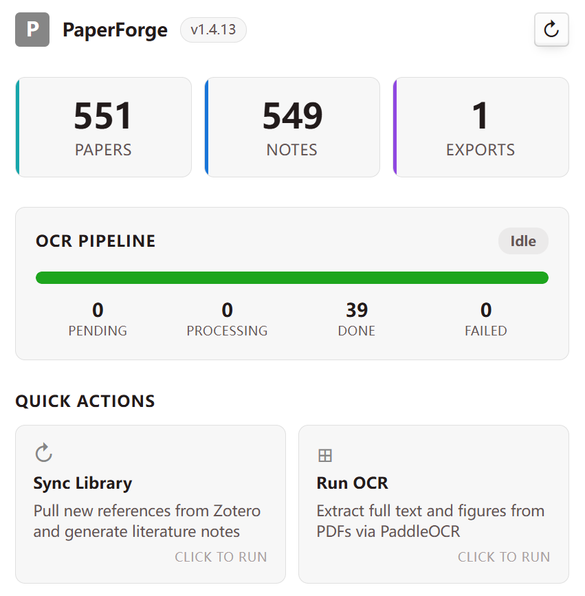

<p align="center">
  
</p>

# PaperForge

[](https://github.com/LLLin000/PaperForge/releases)
[](https://python.org)
[](LICENSE)

**简体中文** · [English](README.en.md)

> **铸知识为器，启洞见之明。**
>
> **Forge Knowledge, Empower Insight.**

PaperForge 是一个面向研究者的 Obsidian 文献工作台。
它针对 Zotero，把零散材料整理为可检索、可追问、可精读的结构化知识资产。

从同步文献，到抽取全文与图表，再到 AI 深读与批判性梳理，整条链路尽量留在同一个知识环境里完成。

```text
下载插件 → 在 Obsidian 启用 → 打开安装向导 → 填写配置 → 点击安装 → 开始使用
```

## 从文献到洞见

PaperForge 不是单纯的 OCR 工具，也不只是 Zotero 到 Obsidian 的搬运脚本。
它更像一座知识炉：把原始论文、附件和图表炼成真正能被研究流程使用的材料。

| 层级 | 产出 | 用途 |
|------|------|------|
| **索引卡片** | 带结构化 frontmatter 的记录（标题、作者、期刊、DOI、标签、摘要） | 搜索、浏览、Base 视图筛选 |
| **全文语料** | OCR 提取的 `fulltext.md` | 提供给 LLM、RAG、检索问答 |
| **图表数据库** | 图表图片、caption 与 figure-map | 多模态分析、图表定位、证据追踪 |
| **精读笔记** | AI 三阶段分析、图表解读、批判评估 | 文献综述、研究设计、写作准备 |

## 为什么值得试试

- **安装路径短**：插件安装 + 向导配置，不要求用户长期在终端里维护流水线。
- **工作流完整**：同步、OCR、图表、精读、Agent 命令都围绕同一个 Vault 组织。
- **对 AI 友好**：输出不是一堆散文件，而是适合检索、提问、精读和后续写作的结构化资产。
- **保留研究现场**：PaperForge 不取代 Zotero 与 Obsidian，而是把它们接成一条可持续使用的研究链。

## 安装

### Obsidian 插件（推荐）

1. 从 [最新 Release](https://github.com/LLLin000/PaperForge/releases/latest) 下载插件文件。
2. 复制到 `vault/.obsidian/plugins/paperforge/`。
3. 在 Obsidian 中启用 `PaperForge`。
4. 打开设置页，点击 `打开安装向导`。
5. 跟随 5 步向导完成安装：概览 → 目录配置 → Agent 与密钥 → 安装 → 完成。

> 安装向导会自动检测 Python、Zotero 和 Better BibTeX 是否就绪。

### 前置准备

| 软件 | 用途 | 获取 |
|------|------|------|
| Python 3.10+ | 运行 PaperForge CLI 与后端流程 | https://python.org |
| Zotero | 文献管理 | https://zotero.org |
| Better BibTeX | Zotero JSON 自动导出 | https://retorque.re/zotero-better-bibtex/ |
| PaddleOCR Key | OCR 文本与版面提取 | https://aistudio.baidu.com/paddleocr |

### 命令行安装（开发者）

```bash
cd /path/to/your/vault
pip install git+https://github.com/LLLin000/PaperForge.git
python -m paperforge setup --headless --agent opencode --paddleocr-key <key>
```

## 使用方式

全部核心流程都可以从 Obsidian 内启动。

| 操作 | 方式 |
|------|------|
| **打开 Dashboard** | `Ctrl+P` → `PaperForge: Open Dashboard`，或点击左侧图标 |
| **同步文献** | Dashboard → `Sync Library`，从 Zotero 拉取数据并生成笔记 |
| **运行 OCR** | Dashboard → `Run OCR`，提取 PDF 全文与图表 |
| **AI 精读** | `/pf-deep <zotero_key>`，执行三阶段深度分析 |
| **快速问答** | `/pf-paper <zotero_key>`，对单篇论文快速提问 |

### Dashboard

<p align="center">
  
</p>

## 命令参考

### Obsidian 命令面板

| 命令 | 说明 |
|------|------|
| `PaperForge: Open Dashboard` | 打开状态面板与快捷操作 |
| `PaperForge: Sync Library` | 同步 Zotero 并生成笔记 |
| `PaperForge: Run OCR` | 提取全文和图表 |

### Agent 命令

| 命令 | 说明 | 前置条件 |
|------|------|---------|
| `/pf-deep <key>` | 完整三阶段精读 | OCR 完成 |
| `/pf-paper <key>` | 快速文献问答 | 已有正式笔记 |
| `/pf-sync` | 同步 Zotero | 已安装 |
| `/pf-ocr` | 运行 OCR | 已安装 |
| `/pf-status` | 查看系统状态 | 已安装 |

### CLI 命令

| 命令 | 说明 |
|------|------|
| `paperforge sync` | 同步 Zotero 并生成笔记 |
| `paperforge ocr` | 运行 OCR |
| `paperforge status` | 查看系统概览 |
| `paperforge doctor` | 诊断配置问题 |
| `paperforge update` | 更新 PaperForge |

## 支持的 Agent 平台

| 平台 | Agent 命令 | 部署位置 |
|------|-----------|---------|
| **OpenCode** | 完整支持全部 `/pf-*` 命令 | `.opencode/command/` + `.opencode/skills/` |
| **Claude Code** | `/pf-deep`, `/pf-paper` | `.claude/skills/` |
| **Cursor** | `/pf-deep`, `/pf-paper` | `.cursor/skills/` |
| **GitHub Copilot** | `/pf-deep`, `/pf-paper` | `.github/skills/` |
| **Windsurf** | `/pf-deep`, `/pf-paper` | `.windsurf/skills/` |
| **Codex** | `$pf-deep`, `$pf-paper` | `.codex/skills/` |
| **Cline** | `/pf-deep`, `/pf-paper` | `.clinerules/` |

在安装向导中选择你的平台，相关文件会自动部署。

## 配置

安装向导会处理绝大多数配置。默认生成的结构如下：

```text
vault/
├── paperforge.json          ← 目录配置 + Agent 平台
├── System/
│   └── PaperForge/
│       ├── .env             ← PaddleOCR API Key
│       ├── exports/         ← Better BibTeX JSON 导出目录
│       └── config/          ← domain-collections.json
├── Resources/
│   ├── Notes/               ← 正文笔记（元数据 + 精读笔记）
│   └── Index_Cards/         ← 索引卡片（按领域组织）
└── Base/                    ← Obsidian Base 视图
```

可选环境变量：

| 变量 | 默认值 | 说明 |
|------|--------|------|
| `PADDLEOCR_API_TOKEN` | — | PaddleOCR API Key |
| `PAPERFORGE_LOG_LEVEL` | `INFO` | 日志级别 |

## 更新

默认可在 Obsidian 重启时自动更新，也可以手动执行：

```bash
paperforge update
# 或
pip install --upgrade git+https://github.com/LLLin000/PaperForge.git
```

## 文档

| 文档 | 内容 |
|------|------|
| [安装后指南](AGENTS.md) | 首次使用与工作流说明 |
| [变更日志](CHANGELOG.md) | 版本历史 |
| [贡献指南](CONTRIBUTING.md) | 开发环境与协作约定 |

## 协议

[CC BY-NC-SA 4.0](https://creativecommons.org/licenses/by-nc-sa/4.0/)。
仅限非商业使用，详见 [LICENSE](LICENSE)。

## 致谢

PaperForge 站在这些优秀项目的肩膀上：

| 项目 | 作用 |
|------|------|
| [PaddleOCR / PaddleOCR-VL](https://github.com/PaddlePaddle/PaddleOCR) | PDF OCR 引擎，负责文字提取、版面检测与图表分割 |
| [Obsidian](https://obsidian.md) | 知识工作台与插件宿主 |
| [Better BibTeX for Zotero](https://retorque.re/zotero-better-bibtex/) | 文献元数据自动导出 |
| [PyMuPDF (fitz)](https://github.com/pymupdf/PyMuPDF) | 本地 PDF 验证与净化 |
| [requests](https://github.com/psf/requests) | OCR API HTTP 客户端 |
| [tenacity](https://github.com/jd/tenacity) | 指数退避重试机制 |
| [Pillow](https://python-pillow.org) | 图表图片处理 |
| [tqdm](https://github.com/tqdm/tqdm) | 进度条 |

> 把论文、PDF、图表与注释从零散材料炼成真正可用的知识器物，这就是 PaperForge 想做的事。
