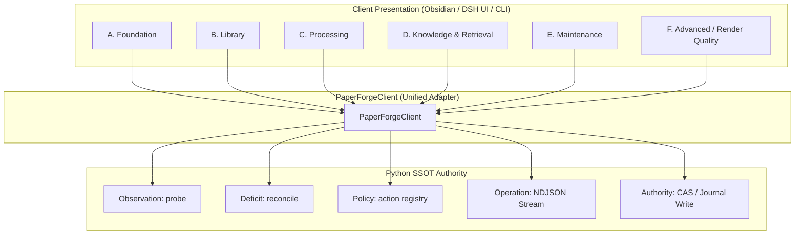

# PaperForge Backend-to-Frontend Contract Mapping

- **Status:** DRAFT / ARCHITECTURE BLUEPRINT
- **Established:** 2026-09-02
- **Purpose:** Decouple frontend presentation from internal backend mechanics. Establish Python as the Single Source of Truth (SSOT) and define the 5 backend contracts and 6 product projection domains.

---

## 1. Architectural Principle: Python Authority as SSOT

CLI commands are not the system's Single Source of Truth; they form a **stable external machine protocol**.
The true SSOT is the **Python Backend Authority Layer**:

```text
Durable Truth (Disk, DB, Vault Config, Keyring, Git)
      ↓
Python Read Models & Authorities (probe / lineage / config / action registry)
      ↓
Reconcile Engine (pure deficit derivation → next_actions)
      ↓
Action Registry (executable policy, safety, confirmation, scope)
      ↓
Machine Protocol Layer (CLI: JSON / NDJSON / stdout)
      ↓
Clients (Obsidian Thin Plugin / Standalone DSH UI / AI Coding Agents / Shell)
```

### Invariants for Client Implementations
1. **No Frontend Truth Derivation**: Clients must never inspect raw disk files, parse filenames, count files, or evaluate heuristics to determine whether a module is "ready", "stale", "broken", or "needs rebuild".
2. **No Frontend Policy Hardcoding**: Whether a button is disabled, whether an action requires a confirmation modal, and what the confirmation warning text says must be sourced from the Python `action registry` or probe envelope, not hardcoded TypeScript switches.
3. **Uniform Protocol Consumption**: Clients communicate with the backend via a single client layer (`PaperForgeClient`) that handles process spawning, managed runtime discovery, stream parsing, and cancellation.

---

## 2. The 5 Backend Core Contracts

```text
                    PaperForge Core (Python)
┌─────────────┬─────────────┬─────────────┬─────────────┬─────────────┐
│ Observation │   Deficit   │   Policy    │  Operation  │  Authority  │
│  (真理观察)  │  (赤字推导)  │  (执行策略)  │  (流式执行)  │  (法定授权)  │
├─────────────┼─────────────┼─────────────┼─────────────┼─────────────┤
│   probe *   │  reconcile  │   action    │   NDJSON    │   explicit  │
│             │             │  registry   │  streaming  │  mutation   │
└─────────────┴─────────────┴─────────────┴─────────────┴─────────────┘
```

### 1. Observation Contract (`probe *`)
- **Question Answered**: *What is the actual state of the system right now?*
- **CLI Surface**: `paperforge probe <module> --json` (where module is `installation | library | ocr | memory | lineage | maintenance | all`).
- **Data Envelope**:
  ```json
  {
    "module": "string",
    "capability_state": "ready | missing_input | needs_action | degraded | unavailable | unknown",
    "severity": "info | warning | error",
    "reason_code": "string",
    "action_primary": {
      "action_id": "string",
      "verb": "string",
      "label": "string"
    },
    "details": {},
    "updated_at": "ISO-8601"
  }
  ```
- **Rule**: Clients render badges, health indicators, and detail disclosures directly from this envelope.

### 2. Deficit / Intent Contract (`reconcile`)
- **Question Answered**: *What is missing between current state and desired state?*
- **CLI Surface**: `paperforge reconcile --scope all|papers [--key KEY] --json`
- **Output**: Pure deficit read model. Emits structured deficits and recommended `next_actions`.
- **Rule**: Reconcile never mutates state. It produces actionable tasks for Overview and Maintenance views.

### 3. Policy / Action Contract (`action registry`)
- **Question Answered**: *Can this action run? Does it need user confirmation? What is its scope?*
- **CLI Surface**:
  - `paperforge action list --json`
  - `paperforge action describe <action_id> --json`
  - `paperforge action preflight <action_id> [--scope all|papers] [--key KEY] --json`
- **Action Descriptor Envelope**:
  ```json
  {
    "action_id": "ocr.rebuild_derived",
    "verb": "rebuild_derived",
    "label": "重建衍生文件",
    "safety_class": "safe | destructive | external",
    "confirmation_prompt": "string | null",
    "availability": "available | unavailable",
    "applicability": "applicable | not_applicable"
  }
  ```
- **Rule**: Client UI controls bind directly to `action_id`.

### 4. Operation Contract (`#137 NDJSON Streaming`)
- **Question Answered**: *What progress has been made? Did it succeed, fail, or cancel?*
- **Protocol**: Long-running operations stream newline-delimited JSON envelopes over stdout:
  1. `start` (`run_id`, `command`)
  2. `phase` (progress update, current step)
  3. `item_result` (per-item outcome)
  4. `terminal` (`result` | `error` | `cancelled`)
- **Cancellation**: Cooperative. Sending `PAPERFORGE_STOP\n` over stdin or issuing `SIGINT`/`SIGTERM` causes graceful cleanup and emits an exact terminal envelope with `status = "cancelled"` and exit code 130.
- **Commands Using Contract**: `setup --json`, `action run <id> --json`, `embed build --json`, `ocr run --json`, `update --json`.

### 5. Authority-Write Contract (Explicit Operator Consent)
- **Question Answered**: *How do high-consequence mutations get safely authorized?*
- **Operations**: `render accept-proposal`, `render promote-r`, `library.prune --force`, `auth delete --yes`, `trash restore`.
- **Requirements**:
  - Exact token binding (e.g. `--plan-hash <SHA-256>`).
  - Pre-condition CAS checks and post-condition audit validation.
  - Fail-closed rollback before commit.
  - Client must display a before/after evidence card before soliciting operator confirmation.

---

## 3. The 6 Product Domain Mappings

Instead of mapping frontend UI to ad-hoc Python files, frontends (Obsidian, DSH UI) project six cohesive functional domains:



### Domain A: Foundation (Runtime, Setup, Config, Credentials)
- **Scope**: Python environment health, vault directories, external tool connections, platform skills.
- **Backend Authorities**:
  - `probe installation --json`
  - `config list/get/set --json`
  - `auth status/set/delete --json`
  - `setup --modular [--headless] --json` (NDJSON)
  - `update --json`
- **Setup Execution Sequence (`SetupPlan`)**:
  ```text
  Step 1: SetupChecker (preconditions, Python >= 3.11)
  Step 2: ConfigWriter (writes explicit CLI args to paperforge.json)
  Step 3: VaultInitializer (creates System/Resources/Literature/Bases + Zotero junction)
  Step 4: ensure_runtime_dependencies (ensures vector extras without redundant reinstall)
  Step 5: AgentInstaller (deploys platform-specific skills with cooperative cancellation)
  Step 6: publish_pointer (~/.paperforge/runtime/active-runtime.json published ONLY on success)
  ```
- **Frontend Refactoring**: Views collect configuration inputs $\rightarrow$ trigger `setup` via `PaperForgeClient` $\rightarrow$ consume NDJSON progress bar $\rightarrow$ refresh via `probe installation`.

### Domain B: Library (Zotero, Collections, Document Index)
- **Scope**: Literature catalog, Zotero database sync, paper records, PDF attachment presence.
- **Backend Authorities**:
  - `probe library --json`
  - `sync [--dry-run]`
  - `search <query> --json`
  - `read <key> --find <text>`
  - `paper-status <key> --json`
- **Frontend Refactoring**: Remove custom sync-state checks in plugin. `probe library` exposes `orphans` and `sync_state`.

### Domain C: Processing (Structural OCR & Rebuilds)
- **Scope**: Document layout parsing, reading order, formula/caption extraction, derived markdown generation.
- **Backend Authorities**:
  - `probe lineage --json` (per-paper `ocr_hash` / `result_hash`)
  - `ocr status --json` / `ocr pipeline-versions --json`
  - `action run ocr.run --json`
  - `action run ocr.rebuild_derived --json`
- **Frontend Refactoring**: In OCR Workspace, the action buttons map directly to `action_id`. Progress bars consume the unified NDJSON event stream.

### Domain D: Knowledge & Retrieval (Memory & Embeddings)
- **Scope**: Memory database, sqlite-vec embeddings, BM25 metadata search, deep semantic retrieval.
- **Backend Authorities**:
  - `probe memory --json`
  - `probe lineage --json` (vector identity validation)
  - `action run memory.build --json`
  - `action run memory.rebuild_vector --json`
  - `retrieve <query> --json`
- **Frontend Refactoring**: Trigger indexing solely through `memory.rebuild_vector` action descriptor; do not implement branching in TypeScript for incremental vs full rebuild.

### Domain E: Maintenance (Control Center & Problem Remediation)
- **Scope**: Orphan cleanup, residual removal across carriers, failed paper retry, trash recovery.
- **Backend Authorities**:
  - `probe maintenance --json` (aggregated actionable issues)
  - `reconcile --scope all --json` (deficit source)
  - `action run library.prune --json`
  - `trash list/restore --json`
- **Frontend Refactoring**: Maintenance view is a pure consumer of the Deficit and Action contracts. Items list deficits; clicking an item executes the prescribed `action_id`.

### Domain F: Advanced / Render Quality (Consistency Audit & Reconcile)
- **Scope**: Layout quality audit, missing figure crop recovery (R), unassigned cluster proposals (P).
- **Backend Authorities**:
  - `render audit <key>` (produces `render.consistency.json`, observed via `probe lineage`)
  - `render reconcile <key> --json` (produces isolated staging and `final_plan_hash`)
  - `render promote-r <key> [OBJECT_ID] --json`
  - `render accept-proposal <key> <label> --plan-hash <hash> --json`
- **Frontend Refactoring**:
  - Placed in paper diagnostic drawer or Maintenance Advanced tab, not on the primary dashboard.
  - R renders an exact repair preview card with an "Apply Repair" button.
  - P renders an evidence card (candidate crop, legend, bounding boxes, SHA-256 token) with an "Accept Proposal" authorization gate.

---

## 4. Frontend Seam: `PaperForgeClient` Architecture

To prevent views from depending on Node.js child process APIs or CLI command-line flags, all calls route through `PaperForgeClient`:

```typescript
export interface PaperForgeClient {
  // 1. Observation
  probe(module: string): Promise<ProbeEnvelope>;
  probeAll(): Promise<Record<string, ProbeEnvelope>>;

  // 2. Deficit / Intent
  reconcile(scope: "all" | "papers", keys?: string[]): Promise<ReconcileReport>;

  // 3. Policy & Actions
  listActions(): Promise<ActionDescriptor[]>;
  describeAction(actionId: string): Promise<ActionDescriptor>;
  preflightAction(actionId: string, scope?: string, keys?: string[]): Promise<PreflightResult>;

  // 4. Operations (NDJSON Streaming)
  runAction(actionId: string, options?: RunOptions): OperationStream;
  setup(config: SetupConfig, options?: RunOptions): OperationStream;

  // 5. High-level Queries & Gateway
  search(query: string, limit?: number): Promise<SearchResult[]>;
  retrieve(query: string, limit?: number): Promise<RetrievalResult[]>;

  // 6. Authority Actions (Render Quality)
  promoteR(key: string, objectIds: string[]): Promise<PromotionResult>;
  acceptProposal(key: string, label: string, planHash: string): Promise<AcceptanceResult>;
}
```

This ensures that porting to a web-based DSH UI or another host environment requires re-implementing only the transport adapter inside `PaperForgeClient`, leaving all presentation views intact.
