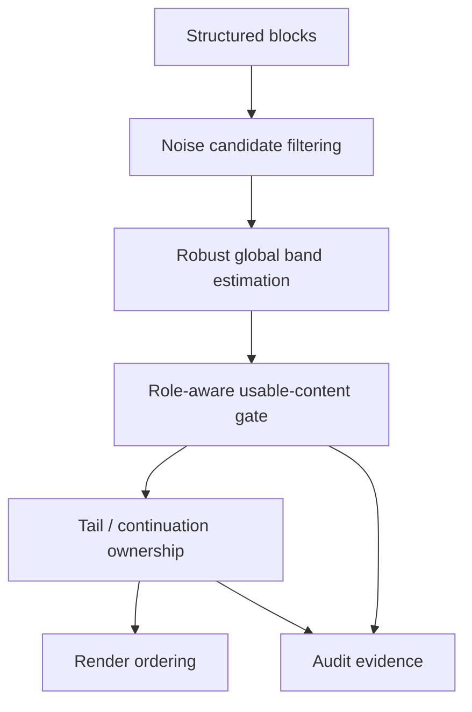

# Layout Robustness Layer — Design Specification

> **Status:** Design revised after review; ready to convert into implementation plan  
> **Scope:** PaperForge OCR layout robustness for global header/footer band estimation, role-aware usable-content gating, tail spread ownership, and two-column continuation behavior  
> **Recommendation:** Keep a global band model, but replace naive aggregation with a robust global estimator; treat continuation / ownership as separate upper-layer layout problems

---

## 0. Executive Summary

PaperForge currently uses a **global header/footer usable-content band** derived from blocks labeled as `noise`, `header`, `footer`, or `number`. The estimator is currently:

- `header_band = max(y2 of top-15%-page noise candidates)`
- `footer_band = min(y1 of bottom-15%-page noise candidates)`

This works on ordinary journal layouts, but fails badly when a paper contains **abnormal margin-band / watermark / downloaded-from publisher strips** or other tall noise blocks. In those cases the global `header_band` can inflate from a normal ~84–110 px to ~984–1575 px, which causes real content to be treated as out-of-band.

The failure is not limited to one render branch. The current band affects:

1. `body_paragraph` promotion in `ocr_document.py`
2. `body_paragraph` routing in `_reorder_tail_run()`
3. `backmatter_body` routing in `_reorder_tail_run()`
4. historically, `reference_item` routing in `_reorder_tail_run()` before the local safety patch that bypasses generic usable-content gating for references

This spec proposes a **layout robustness layer** with three principles:

1. **Robust global estimation** — the band remains global, but outlier noise blocks do not get to define it
2. **Role-aware gating** — a semantic role already established upstream must not be casually overturned by geometric header/footer heuristics
3. **Layer separation** — global header/footer banding, tail ownership, and two-column continuation references are related but distinct problems and must not be conflated into a single heuristic

This spec deliberately does **not** attempt a one-shot rewrite of all tail logic. The design instead separates the system into a stable lower layer (robust global band estimation) and upper layers (continuation refs, tail ownership, backmatter attachment).

---

## 1. Evidence Base

### 1.1 Static code-path study

`_estimate_noise_bands()` is defined in:

- `paperforge/worker/ocr_document.py:3489-3515`

`_is_in_usable_content()` is defined in:

- `paperforge/worker/ocr_document.py:3475-3486`

Current logic:

```python
bbox = block.get("bbox") or block.get("block_bbox")
if not bbox or len(bbox) < 4:
    return True

y1, y2 = bbox[1], bbox[3]
if header_band is not None and y2 < header_band:
    return False
return not (footer_band is not None and y1 > footer_band)
```

Current estimator:

```python
if role in {"noise", "header", "footer", "number"} or raw_label in (...):
    if y2 < page_height * 0.15:
        header_candidates.append(y2)
    if y1 > page_height * 0.85:
        footer_candidates.append(y1)

header_band = max(header_candidates) if header_candidates else None
footer_band = min(footer_candidates) if footer_candidates else None
```

### 1.2 Corpus scan

Sampled corpus slice:

- **73 papers** (~10% of corpus)
- **1019 pages**
- **18363 blocks**

Observed `header_band` distribution:

- median: **87 px**
- mean: **94 px**
- P25 / P75: **84 / 110 px**
- normal range (observed): **46–284 px**
- normal papers: **84.9%**
- catastrophic outliers: **8.2%**
- no-header papers: **5.5%**

Observed catastrophic outlier pattern:

- `BKKR4KIV`, `ES23M9IS`, `CYJLYG56`, `97M7HFCD`, `65L73ZEZ`, `Y4FGBUSM`
- major outlier: `KH3GMDCH`

Common catastrophic signature:

- very tall, narrow margin-band noise blocks
- publisher “Downloaded from …”, “Accepted Manuscript”, or margin watermark text
- top edge falls within the top 15% of the page
- bottom edge extends through most of the page
- global `header_band` is pulled near page bottom

Observed gated real-content roles in catastrophic papers:

- `reference_item` (314 in sample)
- `body_paragraph` (264)
- `figure_asset` (155)

### 1.3 Representative cases

#### 95FDVE4W

- Two-column tail spread
- Left column bottom contains `References` heading and ref 1
- Right column contains refs 2–19 from near top of page to bottom
- A page-3 empty noise block inflates global `header_band` to **213 px**
- Historical symptom: ref 2 rendered before `## References`

This page reveals **two distinct problems**:

1. band-gating can misclassify high-on-page references or body blocks
2. two-column continuation references violate the simple geometric rule `bbox[1] >= ref_bottom`

#### 3CEUN7T3

- Single-column stable layout
- `header_band=109`
- running header is consistent
- first real body content begins below the band on all pages
- no incorrect gating

This is the good-case target behavior.

#### Margin-band watermark papers

Examples from corpus scan show `header_band` at **1326–1575 px**, effectively classifying most of the page as “header zone.” This is a pure estimator failure, not a subtle downstream rendering issue.

---

## 2. Problem Statement

The current design has three coupled weaknesses.

### 2.1 Naive global aggregation

The estimator is global, but not robust. A single abnormal noise block with a large bottom `y2` can dominate the entire paper’s header band.

### 2.2 Semantic role override by geometry

Once a block has a strong semantic role (for example `reference_item`), header/footer heuristics should not casually demote it into ordinary flow. Doing so turns a layout-estimation error into a semantic-routing error.

### 2.3 Banding and continuation logic are conflated

Banding answers one question:

> Is this block likely inside a true header/footer noise region?

Continuation logic answers a different question:

> Given a two-column tail page or a cross-page spread, which structural region owns this block?

The current system lets the first question preempt the second too early.

---

## 3. Non-Goals

This spec does **not** attempt to:

1. redesign all OCR role classification
2. replace the full tail spread / reference ownership pipeline in one pass
3. convert the entire system to page-local bands
4. solve figure/table ownership through the band layer
5. use visual ML to infer headers dynamically at render time

Specifically, this design rejects “page-local only” as the primary strategy. The evidence supports a **global but robust** estimator, not a per-page estimator that jitters with page-local anomalies.

---

## 4. Design Principles

### 4.1 Majority-stable pages define the band

The correct header/footer band is the one consistently supported by the majority of stable pages in the paper, not the maximum excursion of any candidate noise block.

### 4.2 Outlier noise must be filtered before aggregation

Margin-band download strips, accepted-manuscript rails, and publisher watermarks are not header lines. They are outlier noise geometry and must not participate in band definition.

### 4.3 Banding is a lower-layer signal, not a semantic authority

The band layer may veto uncertain body-like blocks, but it must not override already-confirmed semantic roles such as `reference_item`.

### 4.4 Column-aware continuation is a separate layer

Two-column tail spreads require explicit continuation logic. A robust band alone will not solve cases where right-column refs start high on the page while the heading sits at the bottom of the left column.

### 4.5 Every robustness decision must remain auditable

When a noise block is excluded from band estimation, or when a block bypasses band gating due to role, the system must preserve structured evidence for later audit.

---

## 5. Implementation Contract

This section turns the architectural direction into executable contracts.

### 5.1 Band estimator output

Add a new structured return type:

```python
@dataclass
class LayoutBandEstimate:
    header_band: float | None
    footer_band: float | None
    status: str
    method: str
    accepted_candidates: list[dict]
    excluded_candidates: list[dict]
    support_pages: list[int]
    warnings: list[str]
```

Contract:

- `status` ∈ `{"ACCEPT", "HOLD_NO_STABLE_BAND", "EMPTY"}`
- `method` must describe the aggregation mode actually used
- `accepted_candidates` and `excluded_candidates` must preserve enough geometry/text/evidence for audit
- `support_pages` must identify the pages that define the final band

### 5.2 Candidate record contract

Before aggregation, every eligible header/footer noise candidate must be materialized as a structured record:

```python
{
    "page": int,
    "page_width": float,
    "page_height": float,
    "role": str,
    "raw_label": str,
    "text": str,
    "bbox": [x1, y1, x2, y2],
    "x1_ratio": x1 / page_width,
    "x2_ratio": x2 / page_width,
    "y1_ratio": y1 / page_height,
    "y2_ratio": y2 / page_height,
    "width_ratio": width / page_width,
    "height_ratio": height / page_height,
    "candidate_side": "header" | "footer",
    "decision": "accepted" | "excluded",
    "reason": [str, ...],
}
```

Do **not** collapse directly from `structured_blocks` to `(header_band, footer_band)`.

### 5.3 Candidate exclusion contract

Exclude these candidates before aggregation:

```python
exclude if:
  height_ratio > 0.08 and width_ratio < 0.35
  # tall narrow rail / margin-band / vertical strip

exclude if:
  height_ratio > 0.12
  # abnormal tall noise block, even if y2 is still in top 15%

exclude if:
  text is empty or near-empty and height_ratio > 0.04
  # malformed empty noise bbox

exclude if:
  text matches downloaded-from / accepted-manuscript / watermark style
  and geometry is margin-band-like
```

Important constraint:

- text pattern **alone** is insufficient
- geometry **alone** may be insufficient
- use **text + geometry** together for publisher-strip style exclusion

### 5.4 Aggregation contract

Aggregation is page-first, then cluster-based.

Per page:

```python
header_page_value = max(y2 of accepted header candidates on that page)
footer_page_value = min(y1 of accepted footer candidates on that page)
```

Across pages:

```python
cluster_tolerance = max(25 px, 0.015 * median_page_height)
```

Build clusters of page-level values. Select the cluster with greatest page support.

Required support:

```python
support >= max(2 pages, 20% of pages with candidates)
```

Final band:

```python
header_band = p90(cluster_values)
footer_band = p10(cluster_values)
```

If no stable cluster exists:

```python
header_band = None
footer_band = None
status = "HOLD_NO_STABLE_BAND"
```

This is the required contract. Do not substitute arbitrary median / trimmed max / single-page fallback behavior.

### 5.5 Decision API contract

Introduce a structured decision API instead of forcing new logic into a bool helper:

```python
@dataclass
class UsableContentDecision:
    usable: bool
    policy: str
    reason: list[str]
    header_band: float | None
    footer_band: float | None
    role: str
```

New API:

```python
def decide_usable_content(
    block: dict,
    band_estimate: LayoutBandEstimate | None,
    *,
    context: str,
) -> UsableContentDecision:
    ...
```

Backward-compatibility wrapper:

```python
def _is_in_usable_content(block, header_band, footer_band) -> bool:
    return decide_usable_content(...).usable
```

The wrapper may survive temporarily, but all new logic must be authored against the structured decision API.

---

## 6. Target Architecture

The layout robustness layer is divided into four stacked sublayers.



### 6.1 Layer A — Noise candidate filtering

Input: candidate noise/header/footer/number blocks.

Responsibility:

- reject or downweight outlier geometry before band estimation
- identify margin-band / watermark style artifacts
- preserve why a candidate was excluded or included

### 6.2 Layer B — Robust global band estimation

Input: filtered candidate set from Layer A.

Responsibility:

- compute one paper-level `header_band` and one paper-level `footer_band`
- use the aggregation contract from §5.4
- expose supporting-page counts and outlier rejections for audit

Accepted design direction:

- global estimator remains paper-level
- majority-stable pages define the band
- no stable majority cluster ⇒ `None`, not forced overfitting

Rejected design direction:

- per-page header/footer band as the primary system contract

### 6.3 Layer C — Role-aware usable-content gate

Input: semantic block role + robust band estimate.

Responsibility:

- apply band-based gating only where it is semantically defensible
- preserve strong semantic roles from accidental demotion

### 6.4 Layer D — Continuation / ownership layer

Input: blocks that survive or bypass Layer C.

Responsibility:

- resolve two-column continuation references
- attach tail bodies / backmatter bodies to correct owners
- handle cross-page carried sections

Critical separation:

- this layer should not be forced to recover from a bad band estimate
- it must not rely solely on `bbox[1] >= ref_bottom` for two-column continuation references

---

## 7. Role Matrix

The gate behavior must be explicit.

| Role | Band gate behavior | Rationale |
|---|---|---|
| `reference_heading` | bypass | section anchor must not be invalidated by band geometry |
| `reference_item` | bypass | explicit reference semantics outrank band heuristics |
| `reference_body` | bypass | continuation / unnumbered ref body must stay in ref flow |
| `backmatter_heading` | bypass or soft gate | ownership anchor; false negative cost is high |
| `backmatter_boundary_heading` | bypass | structural boundary anchor |
| `backmatter_body` | soft gate | if heading ownership exists, ownership outranks band |
| `body_paragraph` | normal gate | but only against robust band estimate |
| `tail_candidate_body` | normal gate | same principle as body_paragraph |
| `figure_asset` / `table_asset` | no generic text band gate | media ownership should not depend on text header heuristics |
| `noise` / `header` / `footer` / `number` | gate / exclude | these are the intended band-driving roles |

Additional hard contract for `backmatter_body`:

> If a `backmatter_body` has a same-page or carried same-column backmatter heading owner, ownership evidence outranks band exclusion.

---

## 8. Failure Families and Required Handling

### F1 — Margin-band watermark hijacks global band

Examples: Wiley download strips, accepted-manuscript vertical rails, publisher watermarks.

Required handling:

- identify as outlier noise geometry
- exclude from band estimation
- keep evidence in audit output

### F2 — Empty or malformed noise block inflates global band

Example: page 3 empty noise block in `95FDVE4W` with `y2=213`.

Required handling:

- empty/tall anomalies must not define the global band
- exclusion must be explainable

### F3 — Strong semantic block demoted by band gate

Historical example: `reference_item` in high-right-column position.

Required handling:

- role-aware bypass for strong semantic roles

### F4 — Two-column continuation refs fail single-y geometry test

Example: refs in right column begin above left-column heading bottom.

Required handling:

- move ownership logic to a column-aware continuation rule
- do not require `bbox[1] >= ref_bottom` as a necessary condition for all references

### F5 — Tail body promotion suppressed by corrupted band

Affected site: `_promote_tail_body_candidates()` in `ocr_document.py`.

Required handling:

- ensure robust band quality before promotion depends on it
- expose diagnostics when many candidate tail bodies are skipped only by band gate

---

## 9. Rollout Strategy

### Phase 0 — Preserve / enforce safe local patches

Required contract:

> Enforce the validated local patch first: `reference_item` and `reference_body` must bypass generic header/footer usable-content gating during tail reference routing.

This must be treated as a prerequisite, not an assumption about the current repository state.

### Phase 1 — Robust estimator in audit-only mode

This phase must **not** change runtime behavior yet.

Deliverables:

- candidate collection API
- candidate filtering decisions
- robust estimator candidate output
- dry-run diagnostics alongside legacy estimator output

Required audit output shape:

```json
{
  "legacy_header_band": 1575,
  "legacy_footer_band": null,
  "robust_header_band_candidate": 104,
  "robust_footer_band_candidate": null,
  "accepted_candidates": [...],
  "excluded_candidates": [...],
  "support_pages": [...],
  "status": "DRY_RUN"
}
```

### Phase 2 — Enable robust estimator with safe fallback

Enable:

```python
if robust_estimate.status == "ACCEPT":
    use robust bands
elif legacy bands are within safe sanity range:
    use legacy bands
else:
    header_band = None
    footer_band = None
```

This phase still does **not** claim to solve two-column continuation ownership.

### Phase 3 — Role-aware gate normalization

Revisit all `_is_in_usable_content()` call sites and convert them to the decision API + role matrix.

### Phase 4 — Two-column continuation and tail ownership

Redesign reference continuation and tail ownership logic with explicit column reasoning.

Required deliverables:

- replacement for naive `bbox[1] >= ref_bottom` dependency
- tail spread continuation tests
- carried_ref / carried_backmatter interactions documented

Important acceptance boundary:

- Phase 1/2 success means catastrophic band corruption is controlled and strong reference roles are no longer gate-killed
- Full repair of `95FDVE4W`-style two-column continuation behavior belongs to this phase, not to Phase 1

### Phase 5 — Audit and regression hardening

Add corpus-level checks for:

- suspiciously high header bands
- large gated real-content counts
- excluded-candidate diagnostics
- per-paper robustness summaries

---

## 10. Validation Strategy

### 10.1 Estimator unit tests

Required tests:

```python
def test_tall_margin_band_noise_excluded_from_header_band():
    ...

def test_empty_tall_noise_block_excluded_from_header_band():
    ...

def test_stable_running_headers_define_global_band():
    ...

def test_no_stable_noise_candidates_degrades_to_none():
    ...
```

### 10.2 Role-aware gate tests

Required tests:

```python
def test_reference_item_bypasses_usable_content_gate_even_above_header_band():
    ...

def test_reference_body_bypasses_usable_content_gate():
    ...

def test_body_paragraph_still_gated_under_valid_header_band():
    ...

def test_backmatter_body_with_heading_owner_not_dropped_by_band():
    ...
```

### 10.3 Regression papers

Must include at minimum:

- `KH3GMDCH`
- `BKKR4KIV`
- `ES23M9IS`
- `97M7HFCD`
- `3CEUN7T3`
- `95FDVE4W`

`95FDVE4W` must be explicitly marked as:

- Phase 1/2: band-estimation sanity target
- Phase 4: full two-column continuation target

### 10.4 Corpus-level validation

Track on representative sample:

- distribution of `header_band`
- count of gated real-content blocks by role
- catastrophic-paper false-positive reductions
- no regressions on stable ordinary single-column papers

---

## 11. Open Questions

These remain implementation choices, but the architecture is now constrained enough that they no longer block planning:

1. Should dominant-cluster selection use a single-pass tolerance bucket or explicit clustering helper?
2. Should margin-band detection rely first on geometry then text, or score both jointly?
3. Should `figure_asset` / `table_caption` receive any media-specific band override, or is robust band cleanup sufficient?
4. Should the decision API be introduced first in `ocr_document.py` or `ocr_render.py`?
5. How should Phase 4 represent column-aware continuation ownership: explicit per-column anchors, per-spread regions, or reference-zone segment binding?

---

## 12. Recommended Direction

Adopt **robust global estimation** as the canonical strategy.

Specifically:

1. **Do not** switch to page-local bands as the primary model
2. **Do** filter out anomaly noise candidates before aggregation
3. **Do** make the global estimator majority-stable-page driven
4. **Do** preserve strong semantic roles from band demotion
5. **Do** treat two-column continuation refs as a distinct upper-layer ownership problem

This is the smallest architecture that addresses the evidence without overcommitting to a full OCR pipeline rewrite.
