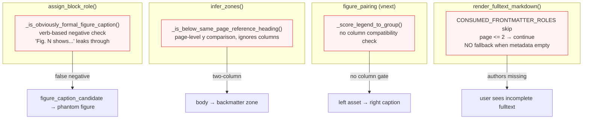

```mermaid
flowchart TB
    subgraph assign_block_role["assign_block_role()"]
        new_heuristic["_is_obviously_formal_figure_caption()<br/>+ inline mention → body_paragraph escape<br/>'Fig. N shows...' → body_paragraph"]
    end
    subgraph infer_zones["infer_zones()"]
        col_aware["_is_below_same_page_reference_heading()<br/>+ _is_in_same_reference_column()<br/>left-column body NOT pulled"]
    end
    subgraph pairing["figure_pairing (vnext)"]
        col_scoring["_score_legend_to_group()<br/>+ _column_compatible_for_caption_asset()<br/>cross-column → score=0, rejected"]
    end
    subgraph render["render_fulltext_markdown()"]
        fallback["_collect_frontmatter_fallback_fields()<br/>BEFORE title rendering<br/>metadata empty → block fallback"]
        safe_skip["CONSUMED_FRONTMATTER_ROLES skip<br/>page <= 2 → continue<br/>SAFE: already consumed"]
    end
    new_heuristic -->|correct| body_role["body_paragraph"]
    new_heuristic -->|formal caption preserved| formal["figure_caption"]
    col_aware -->|left column| body_zone["body_zone ✓"]
    col_aware -->|right column| ref_zone["reference_zone ✓"]
    col_scoring -->|rejected| no_match["no cross-column match"]
    col_scoring -->|compatible| normal_match["normal match"]
    fallback -->|metadata present| skip_block
    fallback -->|metadata empty| render_content["render block content"]
    style new_heuristic fill:#eef2ff,stroke:#6366f1
    style col_aware fill:#eef2ff,stroke:#6366f1
    style col_scoring fill:#eef2ff,stroke:#6366f1
    style fallback fill:#eef2ff,stroke:#6366f1
```

# Four-PR Architecture Hardening Design

> **Date:** 2026-07-05
> **Status:** Ready for implementation
> **Audit Source:** `docs/superpowers/analysis/2026-07-05-layout-truth-audit-findings.md`
> **Design review:** GPT-reviewed (8.2/10 → 9/10 after 8 corrections)

---

## Design Principle

Do not layer new heuristics on top of old ones. Each bug pattern signals a **missing signal** that already exists elsewhere in the pipeline but is not connected to the decision point. The fix is to complete the signal path, not to add another gate.

```
Role layer:    seed role misclassifications only — Fig. N shows ≠ formal caption
Document layer: zone boundary must be column-aware, not page-level
Pairing layer:  caption-asset matching must check column compatibility
Render layer:   metadata consumption must have fallback when metadata is empty
```

---

## Architecture Diagram (Before → After)

See Mermaid below. Key changes per layer:

| Layer | Before | After |
|-------|--------|-------|
| Render | `CONSUMED_FRONTMATTER_ROLES` skip with no fallback | Field-based fallback before title render |
| Role | Verb-based negative check leaks "Fig. N shows..." | Inline mention → `body_paragraph` escape |
| Document | Page-level y comparison ignores columns | `_is_in_same_reference_column()` gate |
| Pairing | Spatial scoring has no column check | `_column_compatible_for_caption_asset()` reject |

<details>
<summary>Before diagram</summary>



</details>

<details>
<summary>After diagram</summary>



</details>

---

## PR 1: Frontmatter Render Fallback

**Risk:** Low. **User impact:** High (authors/affiliations missing from output).

### Problem

`render_fulltext_markdown()` at `ocr_render.py:1160–1866` defines:

```python
CONSUMED_FRONTMATTER_ROLES = frozenset({
    "paper_title", "authors", "doi", "affiliation", "email", "correspondence",
})
```

Then in the body loop:

```python
if role in CONSUMED_FRONTMATTER_ROLES and int(block.get("page", 0) or 0) <= 2:
    continue
```

And metadata section renders from `resolved_metadata` only. When `resolved_metadata["authors"]` or `resolved_metadata["affiliations"]` is empty, the skip contract is violated — blocks are skipped but nothing replaces them.

### Solution

#### New function: `_collect_frontmatter_fallback_fields()`

Return **normalized fallback fields**, not preformatted lines. Merge into the single Paper Metadata callout.

```python
def _collect_frontmatter_fallback_fields(
    structured_blocks: list[dict],
    resolved_metadata: dict,
) -> dict[str, list[str] | str]:
    """Collect frontmatter blocks from pages 1-2 for roles where metadata is empty.
    Returns fields, not lines — caller merges into the single metadata callout.

    Returns:
        title: str — only when resolved_metadata title is empty
        authors: list[str] — only when both authors_display and metadata authors empty
        affiliations: list[str] — when metadata has no equivalent
        emails: list[str] — when metadata has no correspondence
        doi: str — ONLY when resolved_metadata DOI is empty AND block looks like clean DOI
    """
```

**Insertion point:** BEFORE title/authors/metadata rendering, so the flow becomes:

```python
# 1. Collect fallback (runs before any rendering)
fallback = _collect_frontmatter_fallback_fields(structured_blocks, resolved_metadata)

# 2. Title — prefer metadata, fallback to block
title = resolved_metadata.get("title", {}).get("value", "") or fallback.get("title", "")

# 3. Authors — prefer metadata, fallback to block
authors_display = resolved_metadata.get("authors_display", "")
if not authors_display:
    authors = resolved_metadata.get("authors", {}).get("value", [])
    authors_display = ", ".join(authors) if authors else ", ".join(fallback.get("authors", []))

# 4. Metadata callout — single, never duplicated
if authors_display or journal or year or doi or fallback.get("affiliations") or fallback.get("emails"):
    lines.append("> [!info]- Paper Metadata")
    ...
    for aff in fallback.get("affiliations", []):
        lines.append(f"> **Affiliation:** {aff}")
```

**Key:** The body loop skip stays unchanged. Fields are collected before rendering, consumed by metadata section, then body loop safely skips. **Do NOT** remove the `continue` skip, add role exceptions in the body loop, change `render_default`, or return preformatted lines.

### Tests

```python
def test_render_frontmatter_authors_fallback_when_metadata_empty():
    """Page 1 authors block in metadata callout when resolved_metadata has no authors."""
def test_render_frontmatter_affiliations_fallback_when_metadata_empty():
    """Page 1-2 affiliation blocks in metadata callout when none in metadata."""
def test_render_frontmatter_does_not_duplicate_when_metadata_present():
    """Metadata callout has authors from resolved_metadata; frontmatter blocks still skipped."""
def test_render_frontmatter_title_fallback_when_title_metadata_empty():
    """Paper_title block rendered when resolved_metadata title missing."""
def test_render_frontmatter_doi_not_fallback():
    """DOI block never rendered as fallback — metadata DOI is authoritative."""
```

**Files touched:** `paperforge/worker/ocr_render.py`, `tests/test_ocr_render.py`

---

## PR 2: Formal Figure Caption Heuristic Tightening

**Risk:** Medium-low. **Key risk:** false positive on real captions (rotated, sidecar, short).

### Problem

`_is_obviously_formal_figure_caption()` at `ocr_roles.py:193–204` uses `has_verb and has_sentence` as the only rejection guard. "Fig. 9 shows the Mössbauer spectrum..." has `has_verb=True, has_sentence=False` — leaks through to `figure_caption_candidate`.

### Architectural trap: helper False ≠ body_paragraph

**Critical.** Current `assign_block_role()` `_has_figure_prefix` branch:

```python
if _is_obviously_formal_figure_caption(...):
    return figure_caption
return figure_caption_candidate  # ← NOT body_paragraph!
```

Making the helper return False still yields `figure_caption_candidate`, not `body_paragraph`. Fix must add **explicit body escape** in `assign_block_role()` before the caption candidate fallback.

### Solution

#### Phase 1: Body escape in `assign_block_role()`

In the `_has_figure_prefix` branch, before calling `_is_obviously_formal_figure_caption()`:

```python
if raw_label == "text" and _looks_like_inline_figure_mention(text, block):
    return RoleAssignment(
        role="body_paragraph" if block.get("zone") in ("body_zone", None) else "figure_caption_candidate",
        confidence=0.82,
        evidence=[f"inline figure mention in body prose: {text[:60]}"],
    )
```

Zone guard: if no zone set yet, fall to candidate (conservative).

#### Phase 2: `_INLINE_FIGURE_MENTION_PATTERN`

```python
_INLINE_FIGURE_MENTION_PATTERN = re.compile(
    r"^\s*(?:fig(?:ure)?\.?\s+\d+[a-z]?|figs?\.?\s+\d+[a-z]?)\s+"
    r"(?:shows?|illustrates?|depicts?|demonstrates?|presents?|summarizes?|"
    r"reveals?|indicates?|compares?|contains?|provides?|displays?|represents?)\b",
    re.I,
)

def _looks_like_inline_figure_mention(text: str, block: dict | None = None) -> bool:
    """True if text looks like 'Fig. N shows...' — body prose, not a caption."""
    if not text:
        return False
    return bool(_INLINE_FIGURE_MENTION_PATTERN.match(text))
```

Also used as early reject in `_is_obviously_formal_figure_caption()`.

#### Phase 3: Positive evidence for formal captions

```python
_CAPTION_DELIMITER_PATTERN = re.compile(
    r"^\s*(?:figure|fig\.?)\s+\d+[a-z]?\s*[.:|—–]",
    re.I,
)

_CAPTION_TITLE_PATTERN = re.compile(
    r"^\s*(?:figure|fig\.?)\s+\d+[a-z]?\s+"
    r"[A-Z][A-Za-z0-9βγμαΑ-Ω,;:/() -]{3,}",
    re.I,
)

def _looks_like_caption_syntax(text: str) -> bool:
    """Formal caption: delimiter pattern or title pattern. Run AFTER inline-mention reject."""
    if _CAPTION_DELIMITER_PATTERN.match(text):
        return True
    if _CAPTION_TITLE_PATTERN.match(text):
        return True
    return False
```

New `_is_obviously_formal_figure_caption()`:

```python
def _is_obviously_formal_figure_caption(text, block, page_blocks):
    if not _has_figure_prefix(text):
        return False
    if _looks_like_inline_figure_mention(text, block):
        return False
    near_media = _is_near_figure_media(block, page_blocks)
    raw_label = str(block.get("raw_label") or block.get("block_label") or "")
    if raw_label == "figure_title":
        return True
    if near_media and _looks_like_caption_syntax(text):
        return True
    if len(text) <= 80 and _looks_like_caption_syntax(text):
        return True
    return False
```

#### Architecture note: shared pattern source

Define `_looks_like_inline_figure_mention()` in `ocr_roles.py`. Late role resolution in the same file already has `_looks_like_late_figure_narrative_prose()` — the new function should be called from the same places to keep the reject logic single-source.

### Tests

Test `assign_block_role()` output role, not just the helper:

```python
def test_fig_shows_body_mention_not_formal_caption():
    """"Fig. 9 shows results" → assign_block_role returns body_paragraph."""
def test_fig_period_caption_remains_caption():
    """"Figure 1. Histological analysis" → figure_caption."""
def test_near_media_does_not_rescue_inline_body_mention():
    """Block near figure_asset but "Fig. 2 shows..." → body_paragraph."""
def test_figure_title_raw_label_still_caption():
    """raw_label=figure_title → figure_caption regardless of text."""
def test_short_near_media_formal_caption_preserved():
    """"Fig. 3. Results" near media → figure_caption."""
def test_caption_delimiter_pattern_matches():
    """"Figure 1. xxx", "Fig. 2: xxx" → _looks_like_caption_syntax True."""
def test_caption_title_pattern_matches():
    """"Fig 1 Histological analysis" → _looks_like_caption_syntax True."""
def test_caption_delimiter_rejects_inline_mention():
    """"Fig. 9 shows" → delimiter does NOT match (no . or : after number)."""
```

**Fixture verification criteria** (not "all 8 gold fixtures preserved" — too vague):

| Fixture | Expected outcome |
|---------|-----------------|
| All 8 gold | No decrease in `matched_figures` UNLESS decrease = documented phantom-caption removal |
| All 8 gold | No increase in rejected formal legends that have `figure_number` marker |
| All 8 gold | No increase in `unmatched_assets` UNLESS caused by phantom caption removal |
| 2HJSWV3V | `matched_figures` should DECREASE (phantom Fig 8/9 captions removed from body text) |

**Files touched:** `paperforge/worker/ocr_roles.py`, `tests/test_ocr_roles.py`, `tests/test_ocr_figures.py`

---

## PR 3: Same-Page Reference Boundary — Column-Aware Zone Inference

**Risk:** Medium. **Key constraint:** preserve single-column same-page boundary (verified correct in 28JLIHLS audit).

### Problem

`infer_zones()` at `ocr_document.py` uses this real signature:

```python
def _is_below_same_page_reference_heading(block, refs_start_page, ref_heading_top):
    """Does NOT scan page_blocks — uses pre-located ref_heading_block from infer_zones()."""
```

`infer_zones()` has already found `ref_heading_block` and `ref_heading_top` before `same_page_tail_blocks`:

```python
same_page_tail_blocks = [
    block for block in blocks
    if _is_below_same_page_reference_heading(block, refs_start_page, ref_heading_top)
    and not _is_reference_item_candidate(block)
    and not _is_reference_heading_candidate(block)
    and block.get("block_id") is not None
]
```

On two-column pages where **right** column has References heading, **left**-column body below that y is pulled into `same_page_tail_blocks` → `tail_nonref_hold_zone`. The fix is to add a column check — do NOT add `_find_same_page_reference_heading(block, page_blocks)` (unnecessary scan).

### Solution

#### New helper: `_is_in_same_reference_column()`

```python
def _is_in_same_reference_column(
    block: dict,
    ref_heading_block: dict | None,
    page_width: float,
) -> tuple[bool, str]:
    """Check if block is in the same column as the reference heading.

    Returns (same_column, reason).
    - ref_heading_block is None → (True, "no_ref_heading")       [conservative]
    - ref heading is full-width  → (True, "full_width_ref")      [page-level boundary]
    - missing bbox on either    → (True, "missing_bbox_legacy")  [conservative]
    - same column band          → (True, "same_column")
    - different column bands    → (False, "cross_column")
    """
```

#### Column helper (private to `ocr_document.py`)

Do NOT import from `ocr_figures._column_band_id()` — avoid document→figure dependency.

```python
def _block_column_band(bbox, page_width):
    """0=left, 1=right, None=center/ambiguous."""
    if not bbox or len(bbox) < 4 or not page_width:
        return None
    cx = (bbox[0] + bbox[2]) / 2.0
    if cx < page_width * 0.45:
        return 0
    if cx > page_width * 0.55:
        return 1
    return None

def _is_full_width_ref_heading(ref_block, page_width, threshold=0.7):
    bbox = ref_block.get("bbox") or [0, 0, 0, 0]
    return (bbox[2] - bbox[0]) >= page_width * threshold
```

#### Modification point

```python
same_page_tail_blocks = [
    block for block in blocks
    if _is_below_same_page_reference_heading(
        block, refs_start_page,
        ref_heading_top if ref_heading_block else None,
    )
    and _is_in_same_reference_column(
        block, ref_heading_block,
        _page_width_for_block(block, body_anchor),
    )
    and not _is_reference_item_candidate(block)
    and not _is_reference_heading_candidate(block)
    and block.get("block_id") is not None
]
```

`_page_width_for_block()` already exists in `ocr_document.py` or can be derived from `body_anchor`.

### Tests

```python
def test_same_page_reference_heading_does_not_pull_left_column_conclusion():
    """Two-column: left column Conclusions NOT pulled into tail zone when ref heading in right."""
def test_same_page_reference_heading_pulls_same_column_tail_note():
    """Two-column: right-column note below ref heading IS pulled into tail zone."""
def test_single_column_same_page_reference_boundary_still_works():
    """Single-column same-page boundary still detected (no regression)."""
def test_same_page_reference_heading_full_width_ref_still_page_level():
    """Full-width References heading still pulls page-level body below it."""
def test_same_page_reference_heading_no_ref_on_page_no_change():
    """Page without reference heading — column check is no-op."""
def test_28jlihls_single_column_clear_separation_preserved():
    """Single-column fixture: remains FALSE POSITIVE (no false alarm from audit)."""
def test_left_column_conclusion_final_role_can_render_as_body():
    """Left-column Conclusion on shared ref page has role=body_paragraph, zone=body_zone."""
```

**Files touched:** `paperforge/worker/ocr_document.py`, `tests/test_ocr_document.py`

---

## PR 4: VNext Figure Pairing — Column Compatibility in Candidate Scoring

**Risk:** Medium. **Key constraint:** sidecar captions (same-row adjacent column) must survive.

### Problem

`PrimarySamePagePass` calls `_score_legend_to_group()` in `ocr_figures.py`. The scoring function considers spatial distance, text overlap, and orientation, but does NOT check column compatibility. `_is_safe_page_assets_group()` has a column band gate that rejects cross-column groups, but that gate only applies to the `page_assets` step, NOT to caption-to-group scoring.

### Solution

#### 1. Distinguish full-width vs ambiguous-center

`_column_band_id()` returns `None` for center/ambiguous — do NOT treat `None` as full-width.

```python
def _is_full_width_bbox(bbox, page_width, threshold=0.65):
    """True if block spans most of the page width."""
    return (bbox[2] - bbox[0]) >= page_width * threshold
```

#### 2. `_column_compatible_for_caption_asset()`

Check: full-width → compatible; same column → compatible; explicit cross-column → rejected; center/ambiguous → compatible but requires strong spatial score.

```python
def _column_compatible_for_caption_asset(
    caption_bbox: list[float],
    asset_bbox: list[float],
    page_width: float,
) -> tuple[bool, str]:
    """Returns (compatible, reason).

    Compatible means CAN be same figure, not MUST.
    - full-width → always compatible
    - same column band → compatible
    - both center/ambiguous → compatible, but no positive bonus
    - one center, one explicit → compatible (can't confidently reject)
    - different explicit bands → incompatible ("cross_column")
    """
    if not caption_bbox or len(caption_bbox) < 4 or not asset_bbox or len(asset_bbox) < 4:
        return True, "no_bbox"

    if _is_full_width_bbox(caption_bbox, page_width) or _is_full_width_bbox(asset_bbox, page_width):
        return True, "full_width"

    cap_band = _column_band_id(caption_bbox, page_width)
    asset_band = _column_band_id(asset_bbox, page_width)

    # Both None → center/ambiguous, no confidence to reject
    if cap_band is None and asset_band is None:
        return True, "both_center"

    # One center → compatible (could be sidecar or single-column figure)
    if cap_band is None or asset_band is None:
        return True, "one_center"

    # Same explicit column → compatible
    if cap_band == asset_band:
        return True, "same_column"

    # Different explicit columns → incompatible
    return False, f"cross_column:cap={cap_band}_asset={asset_band}"
```

#### 3. Integration point in `_score_legend_to_group()`

Column check must run **before** `safe_auto_match` — otherwise safe_auto_match bypasses the new gate:

```python
def _score_legend_to_group(legend, group, page_width, ...):
    # --- Column compatibility check (runs BEFORE safe_auto_match) ---
    legend_bbox = legend.get("bbox") or [0, 0, 0, 0]
    compatible, reason = _column_compatible_for_caption_asset(
        legend_bbox,
        group.get("cluster_bbox", [0, 0, 0, 0]),
        page_width,
    )
    if not compatible:
        return {
            "score": 0.0,
            "decision": "rejected",
            "evidence": ["cross_column_caption_asset", reason],
        }

    gt = group.get("group_type", "")
    # ...existing safe_auto_match and scoring logic...
```

#### 4. Sidecar exception — DO NOT implement in PR 4

Sidecar exception (narrow caption in left column matches same-row right-column asset) is too risky for this PR. If a sidecar regression appears, handle in a separate `SidecarPass` change. PR 4 only adds hard cross-column rejection and full-width/center compatibility.

#### 5. Candidate group metadata enrichment

In `_candidate_group_entry()`:

```python
{
    ...
    "column_band": _group_column_band(media_blocks, page_width),
    "column_evidence": "...",
}
```

`_group_column_band()` returns dominant band or `None` for multi-column composite figures.

### Tests

```python
def test_primary_same_page_rejects_cross_column_caption_asset():
    """Left-column caption NOT matched to right-column asset group."""
def test_primary_same_page_allows_full_width_caption_to_center_asset():
    """Full-width caption in center band matches center asset group."""
def test_composite_multi_column_group_allows_caption_match():
    """Group spanning both columns (composite) allows caption in either column."""
def test_cross_column_rejection_does_not_affect_same_column_matches():
    """All existing same-column fixtures preserve match count."""
def test_28jlihls_fig5_assets_not_assigned_to_fig6():
    """Regression: Figure 5 left-column assets not assigned to Figure 6 right-column caption."""
def test_center_band_caption_still_matches_center_asset():
    """Both center/ambiguous → compatible (no false rejection)."""
```

**Files touched:** `paperforge/worker/ocr_figures.py`, `tests/test_ocr_figures.py`

---

## Deferred (Not in the 4-PR Plan)

### PR 5: Frontmatter Heading Exact Labels
Add `_FRONTMATTER_SECTION_LABELS` for "ARTICLE INFO" → `frontmatter_heading`. Low priority.

### PR 6: Supplementary-Only Document Mode
Design `document_mode` detection at pipeline entry. Separate feature, not a bugfix.

---

## Execution Order

Recommended: **PR 1 → PR 2 → PR 3 → PR 4**

| Step | Why this order |
|------|----------------|
| PR 1 | Pure render fallback, lowest risk, highest user impact |
| PR 2 | Reduces phantom captions → cleaner figure/table audit signal |
| PR 3 | Zone behavior change, isolated from caption changes |
| PR 4 | Pairing change last, avoids conflict with caption pool changes |

All 4 PRs are logically independent and can be implemented in separate branches without merge conflicts.

### Verification

```bash
# Full test suite
python -m pytest tests/test_ocr_*.py -v --tb=short
# Real-paper regressions (8 gold fixtures)
python -m pytest tests/test_ocr_real_paper_regressions.py -v --tb=short
# Vault corpus diff
python scripts/dev/corpus_v3_diff_full.py
```

### Cross-Cutting Architecture Rule

Every change must pass the **deletion test**: if you delete the new function, does complexity vanish or concentrate?

| Function | Deletion test |
|----------|---------------|
| `_collect_frontmatter_fallback_fields()` | Authors missing from output returns → **good** |
| `_is_in_same_reference_column()` | Zone pollution on two-column pages returns → **good** |
| `_column_compatible_for_caption_asset()` | Cross-column figure mis-assignment returns → **good** |
| `_is_obviously_formal_figure_caption()` tightening | Fig-N-shows returns to caption pool → **good** |
