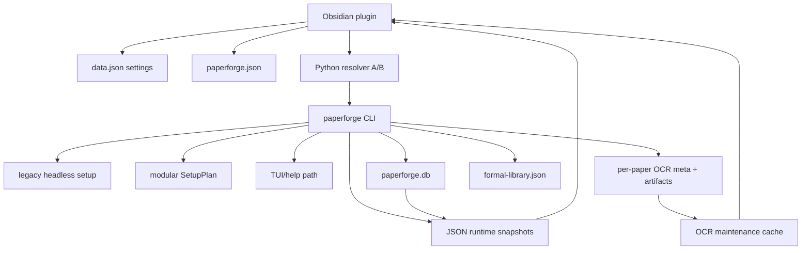

# PaperForge Control-Center Contract Audit

**Date:** 2026-07-14
**Issue:** [#66 — Audit the current setup, readiness, and recovery contracts](https://github.com/LLLin000/PaperForge/issues/66)
**Parent map:** [#65 — Make the PaperForge control center self-explanatory](https://github.com/LLLin000/PaperForge/issues/65)
**Scope:** Current plugin and Python setup, configuration, readiness, update, failure, cache, and recovery contracts. Planning evidence only; no production behavior changed.

## Executive verdict

PaperForge has mature domain engines but no single control-plane contract. Today the user experience is assembled from three setup implementations, two path readers with opposite legacy precedence, multiple Python resolvers, five readiness state machines, SQLite materialized state, three plugin-facing runtime snapshots, per-paper OCR metadata, and a plugin maintenance cache.

The replacement control center must not preserve these implementation boundaries. It must preserve the underlying recovery capabilities while consolidating ownership:

1. `paperforge.json` remains the authoritative vault/path configuration.
2. A selected managed Python runtime becomes the sole command runtime for the plugin.
3. Backend capability probes own readiness facts; the plugin renders them without reclassification.
4. SQLite and per-paper OCR metadata remain durable truth; JSON snapshots are treated as versioned caches with freshness metadata.
5. Maintenance contains only actionable failures or stale derived artifacts with a concrete recovery action.
6. Setup completion is replaced by independent module capability states.

## 1. Current control-plane topology



The dominant data pattern is:

```text
canonical files / JSONL logs
        ↓
SQLite materialized views and indexes
        ↓
JSON snapshots for plugin consumption
        ↓
plugin display state and actions
```

This is viable only if each lower layer has one owner and every derived layer carries an explicit revision/freshness contract. That condition is not met today.

## 2. Setup and configuration inventory

### 2.1 Three setup paths

`paperforge/cli.py:733-766` routes setup to three implementations:

| Route | Implementation | Current behavior | Assessment |
|---|---|---|---|
| `setup --headless` | `paperforge/setup_wizard.py:headless_setup` | Mature seven-phase flow; creates directories, deploys worker/plugin/skills, writes config, installs runtime, verifies files | Preserve behavior, replace implementation |
| `setup --modular` | `paperforge/setup/plan.py:SetupPlan.execute` | Structured `SetupStepResult`; checker, config writer, vault initializer, runtime installer, agent installer | Good result envelope, incomplete product install |
| `setup` without flags | `paperforge/setup_wizard.py:main` | Legacy TUI/help path | Remove after migration |

The two active paths do not install the same product:

- Headless deploys worker scripts, Obsidian plugin files, skills, `.env`, and rich `paperforge.json` metadata.
- Modular installs the Python package and agent files but has no plugin/worker deployment step.
- `paperforge/cli.py` passes only path config and agent type into `SetupPlan`; `zotero_path`, `env_values`, and version remain unset despite being constructor inputs (`paperforge/setup/plan.py:22-38`).

### 2.2 Confirmed setup defects

#### P0 — Source-checkout headless install can report success without installing the runtime

`paperforge/setup_wizard.py:774-817` assigns `install_target` when `repo_root/pyproject.toml` exists but never executes pip in that branch. `result` is then referenced at line 802 before assignment. The exception is downgraded to `[WARN] pip install skipped`; Phase 7 checks deployed files but does not import/validate the installed package. The command can therefore return `0` with the runtime missing or stale.

#### P1 — `--literature-dir` is accepted and silently dropped

The parser defines `--literature-dir` at `paperforge/cli.py:436-440`. The headless call at `paperforge/cli.py:749-762` forwards system, resources, base, Zotero, and OCR values but omits `literature_dir`.

#### P1 — Modular JSON output hides failed steps

`SetupPlan.execute(json_output=True)` prints every result and unconditionally returns `0` (`paperforge/setup/plan.py:81-84`). Automation cannot use the process exit code as a success contract.

#### P1 — Modular directory semantics differ from the canonical path builder

`paperforge/config.py:paperforge_paths` defines Literature as `<vault>/<resources_dir>/<literature_dir>`. `VaultInitializer.create_directories` creates `resources_dir` and `literature_dir` as independent vault-root directories. A modular install can therefore create a directory tree that the runtime does not read.

### 2.3 Configuration authority and contradictory precedence

The intended Python authority is `paperforge/config.py:load_vault_config` with this locked precedence:

```text
defaults
< nested paperforge.json.vault_config
< legacy top-level paperforge.json keys
< process environment
< explicit overrides
```

However, plugin readers use the opposite file precedence:

- `paperforge/plugin/src/main.ts:readPaperforgeJson`
- `paperforge/plugin/src/services/memory-state.ts:readPathConfig`

Both evaluate `vault_config` before legacy top-level fields. If both schemas coexist with different values, Python and the plugin resolve different paths.

The plugin also mirrors the resolved path values into `data.json` settings on load (`main.ts:307-317`) while writing canonical updates back to `paperforge.json` (`main.ts:255-299`). This creates a temporary duplicated representation even though `paperforge.json` is intended to own paths.

### 2.4 Setup-completion contradiction

The plugin stores a global `setup_complete` boolean in Obsidian `data.json`. The settings tab only invalidates it when `paperforge.json` is missing (`settings.ts:191-196`); it has no schema, package-version, runtime, plugin-bundle, Zotero, OCR, memory, or vector gate.

The wizard itself contains contradictory requirements:

- `views/step3-gate.ts:3-10` blocks progress when Zotero path or OCR-key validation is absent.
- Final validation in `views/modals.ts:766-775` labels both as optional-later warnings.

A replacement must delete the global semantic and expose independent capability states.

## 3. Python runtime and update contracts

### 3.1 Duplicate runtime discovery

The plugin has two runtime resolvers:

| Resolver | Location | Behavior |
|---|---|---|
| `resolvePythonExecutable` | `services/python-bridge.ts:62` | One-shot resolution used by primary command paths |
| `getCachedPython` | `services/memory-state.ts:274` | Process-global cache; checks manual path, Windows-style venv candidates, then `py/python/python3`, and finally returns `python` even when no candidate validated |

`getVectorRuntime` independently searches only Windows-style `Scripts/python.exe` candidates before falling back to a JSON snapshot (`memory-state.ts:173-221`). Runtime selection is therefore not one coherent contract and is not cross-platform complete.

### 3.2 Update behavior

Python `paperforge/worker/update.py:run_update` detects pip, editable, git, or zip installs. The zip path has backup and rollback. This recovery behavior should be preserved.

Plugin startup `_autoUpdate` (`main.ts:105-137`) performs a separate PyPI-then-git installation path. It reports success but has no user-visible terminal failure state when both sources fail. Setup and update therefore duplicate package-install logic and failure presentation.

### 3.3 Required runtime decision

The control center cannot make setup or readiness deterministic until [#70](https://github.com/LLLin000/PaperForge/issues/70) selects one runtime owner. The selected design must provide:

- stable runtime identity, path, Python version, PaperForge version, and install source;
- atomic install/update/rollback result;
- no silent fallback to an unrelated system Python after a managed runtime has been selected;
- one resolver shared by every plugin command;
- actionable unsupported-platform and missing-runtime states.

## 4. Persistence and state ownership

| Domain | Durable truth | Derived/cache state | Current readers/writers | Decision |
|---|---|---|---|---|
| Vault paths | `paperforge.json` | path copies in plugin settings | Python config, plugin main, memory-state | Preserve authority; remove mirrors |
| Plugin preferences | Obsidian `data.json` | ephemeral stale flags | plugin load/save settings | Preserve UI preferences only |
| OCR | per-paper `meta.json` + raw/canonical/structure artifacts | `ocr_health.json`, rendered Markdown, maintenance cache | OCR pipeline, maintenance CLI, plugin | Preserve/version |
| Paper catalog | `formal-library.json` | dashboard fallbacks | sync, dashboard, memory builder, OCR | Preserve as canonical catalog; expose revision |
| Memory/search | `paperforge.db` schema v6 | FTS/vec0 derived tables | memory/embed builders and queries | Preserve/migrate in SQLite |
| Vector build | SQLite `build_state` | legacy `vector-build-state.json` path | embed CLI and plugin | Remove legacy JSON contract |
| Runtime readiness | live probes against config/files/DB | three JSON snapshots | CLI snapshot writers, plugin readers | Version and freshness-gate, then consolidate |
| OCR maintenance | per-paper metadata/health | `ocr_maintenance.json` SHA256 cache | backend manifest, plugin cache | Preserve manifest invalidation |
| Credentials | process env, plugin `data.json`, vault `.env` | none | embedding config and settings UI | Decide secure owner; never export secret |

### 4.1 Credential precedence

`paperforge/embedding/_config.py:get_api_key` currently resolves:

```text
VECTOR_DB_API_KEY / OPENAI_API_KEY process environment
→ plugin data.json vector_db_api_key
→ vault .env
```

The key may therefore exist in two plaintext files with no coherency or redaction contract. [#69](https://github.com/LLLin000/PaperForge/issues/69) must define `missing`, `configured`, `invalid`, and `unavailable` states without exposing the credential. Diagnostic/Issue exports must redact values and environment contents.

## 5. Readiness state machines

Five independent machines exist today:

1. **OCR execution:** `pending → queued → running → done | done_degraded | retryable_error | fatal_error | nopdf | blocked`.
2. **OCR version/artifact:** raw/derived version plus `derived_stale`, `raw_upgradable`, and legacy/no-version states.
3. **Embedding build:** `idle | running | stopping | completed | failed`, persisted in SQLite `build_state`.
4. **Memory DB:** schema version, canonical-index hash, FTS readiness, and paper counts.
5. **Runtime health:** bootstrap/read/write/index/vector layers summarized as `ok | degraded | blocked` with repair commands.

These machines should remain independent. The current plugin frequently collapses them into global or boolean states such as `setup_complete`, `memoryReady`, and `vectorReady`.

### 5.1 Snapshot freshness gap

The CLI writes:

- `memory-runtime-state.json`
- `vector-runtime-state.json`
- `runtime-health.json`

through `paperforge/memory/state_snapshot.py:17-71`.

`memory-state.ts:buildSnapshot` reads `updated_at` only for display but determines readiness from booleans/counts (`memory-state.ts:328-365`). It has no schema/version/revision/TTL comparison. A stale green snapshot can therefore survive a changed runtime, database, model, or configuration until another command refreshes it.

The replacement contract must attach at least:

```text
schema_version
computed_at
runtime_identity
paperforge_version
config_revision
canonical_index_revision
source_db_revision
```

A mismatched or expired snapshot is `unknown/stale`, never `ready`.

### 5.2 Legacy vector build state

SQLite `build_state` is the durable vector-build owner. `memory-state.ts:resolveVaultPaths` still exposes `vector-build-state.json`, and `embedding/build_state.py` retains fallback compatibility. Preserve SQLite ownership; migrate once, then remove the plugin-facing legacy path.

### 5.3 OCR maintenance ownership

The Python backend already emits normalized display and action fields through `OCRMaintenanceRow`, `compute_maintenance_manifest`, and `collect_maintenance_rows` (`worker/ocr_maintenance.py:284-390`). The plugin still contains `categorizeMaintenanceRow` (`services/ocr-maintenance-ui.ts:62`) and can add presentation semantics from raw fields.

The #64 branch has already moved the Recommended filter to the backend `_needs_derived_rebuild()` contract and added cache-schema migration. Finish the direction: Python owns facts/actions; TypeScript owns labels/layout only.

A preliminary scout reported `done_degraded` missing from `OCR_QUEUE_STATUSES`. Revalidation against the current worktree disproved that claim: `worker/ocr.py:91-102` includes `done_degraded` in both queue and settled contracts. It is not an open finding.

## 6. Failure and recovery matrix

| Failure/state | Current detector | Current recovery | Preserve/migrate |
|---|---|---|---|
| Missing bootstrap/config | runtime-health bootstrap probe; setup flag/file checks | run setup | Migrate to capability state with exact missing prerequisite |
| Invalid/stale Python | manual path existence and resolver probes | choose another Python / reinstall | Replace with managed-runtime repair |
| Setup step failure | subprocess exit, legacy numeric codes, or `SetupStepResult` | retry whole setup | Preserve structured result; add resumable per-step retry and rollback |
| Package update failure | update worker or startup installer | PyPI→git; zip rollback only | Centralize and expose terminal failure |
| OCR submit/poll/upload failure | per-paper `error_stage` | full OCR redo | Preserve |
| OCR derived artifact stale | version/hash predicate | derived-only rebuild | Preserve |
| OCR legacy artifact | version classifier | redo/backfill | Preserve with explicit migration state |
| Embedding stale PID | build state + PID liveness | reset to idle/rebuild | Preserve |
| Embedding model changed | stored/current model mismatch | full re-embed | Preserve |
| Memory schema mismatch | SQLite schema check | transactional migration or drop/rebuild | Preserve; surface backup/rebuild action |
| Canonical index changed | canonical-index hash | incremental/full memory rebuild | Preserve |
| Snapshot stale/unknown | currently not detected consistently | command refresh | Add revision/TTL gate and refresh action |
| Corrupt maintenance cache | JSON parse/schema failure | full refetch | Preserve; never show empty as healthy |
| Unacceptable OCR quality | currently no product reporting flow | manual issue | Add reviewed, privacy-safe GitHub Issue draft only |

## 7. Duplications and contradictions ranked

### Critical

1. **Headless setup can exit successfully after skipping runtime installation.**
2. **Python and plugin resolve conflicting path values differently when nested and legacy keys coexist.**
3. **Global `setup_complete` can remain true while individual capabilities are unavailable.**
4. **Runtime snapshots can be stale but still render as ready.**

### Important

5. Three setup implementations produce different installations.
6. Two Python resolvers and an additional vector-specific resolver can select different runtimes.
7. Modular setup JSON mode returns success despite failed steps.
8. OCR/Zotero inputs are mandatory in the wizard gate but optional in final validation.
9. Python and TypeScript both derive maintenance presentation/action semantics.
10. Embedding credentials span environment, plugin settings, and `.env` without a lifecycle contract.
11. Auto-update has a separate package-install path and no terminal user-visible failure when both sources fail.
12. Legacy vector-build JSON remains in plugin path inventory after SQLite migration.

### Cleanup

13. `auto_update` and `auto_update_on_startup` overlap; only the latter drives behavior.
14. `agent_platform` and `selected_skill_platform` overlap.
15. Saved custom-Python staleness is an in-memory flag, not a durable diagnostic state.
16. Standalone validation and setup checkers duplicate canonical config/runtime probes.

## 8. Preserve / migrate / remove

### Preserve

- `paperforge/config.py` path inventory and explicit source tracing.
- Per-paper OCR `meta.json`, version hashes, raw/canonical split, health artifacts, and rebuild/redo separation.
- SQLite schema migrations, `build_state`, FTS, vec0, and canonical-index hash.
- `formal-library.json` atomic/filelock writes.
- OCR maintenance SHA256 manifest invalidation.
- Runtime-health layered probes and repair-command concept.
- Update backup/rollback and PyPI→git fallback, behind one owner.
- Cooperative stop between papers.

### Migrate

- Headless setup behavior into one structured, resumable setup engine.
- `setup_complete` into per-module capability records.
- All plugin command execution onto one selected runtime identity.
- Runtime snapshots into versioned/freshness-gated capability responses.
- Legacy top-level path keys into `vault_config`, with one precedence rule on both sides.
- Memory provider credentials into the storage contract chosen after security review.
- Maintenance action derivation into backend-owned canonical responses.

### Remove after cutover

- Legacy TUI/help setup route.
- `--modular` as a separate behavior; its structured step model becomes the only engine.
- Duplicate AgentInstaller skill-copy implementation in favor of `services/skill_deploy.py`.
- Plugin path mirrors that can diverge from `paperforge.json`.
- Global `setup_complete` product state.
- `vector-build-state.json` plugin path/fallback after one migration window.
- Independent Python discovery implementations.
- Frontend maintenance reclassification.

## 9. Required replacement contracts

### 9.1 Capability response

Every module probe should return the same envelope:

```json
{
  "module": "ocr",
  "state": "ready | needs_input | needs_action | running | limited | unavailable | unknown",
  "reason_code": "stable-machine-code",
  "summary": "localized-human-summary-key",
  "action": {
    "id": "configure_ocr",
    "kind": "open_setting | run_command | open_url | create_issue_draft",
    "destructive": false
  },
  "source_revision": "...",
  "computed_at": "..."
}
```

Rules:

- State is factual; severity and next action are not inferred in TypeScript.
- `unknown` and stale are not success.
- Every `needs_action` has exactly one primary next action.
- Destructive/rebuild actions declare data preserved, replaced, and rollback availability.

### 9.2 Operation response

Setup, update, rebuild, repair, and migration share:

```text
operation_id
module
phase
current/total
terminal_state: succeeded | failed | stopped | partial
reason_code
human_message_key
diagnostics_ref
retry_action
rollback_state
```

Process exit codes must agree with terminal state.

### 9.3 Persistence ownership

- `paperforge.json`: paths and install/runtime metadata.
- Obsidian `data.json`: user interface preferences only.
- SQLite: memory/vector durable state and operation/build state.
- Per-paper OCR tree: OCR source and derived artifact state.
- JSON snapshots: disposable caches only, never sole truth.
- Secret storage: one chosen owner; diagnostic output always redacted.

## 10. Decisions unblocked by this audit

This audit resolves the current-state question in #66 and provides inputs for:

- **#69 capability vocabulary:** use independent module states; delete global completion semantics; backend owns reason/action codes.
- **#70 runtime architecture:** one runtime identity and command resolver is mandatory; fallback behavior must be explicit.
- **#71 control-center prototype:** render six independent module cards from the capability envelope.
- **#72 maintenance/reporting prototype:** show actionable states only and generate reviewed, redacted issue drafts.
- **#73 migration:** migrate path schema, setup state, runtime selection, snapshots, vector build state, and credentials with explicit acceptance checks.

## Evidence index

| Contract | Source |
|---|---|
| Setup route split | `paperforge/cli.py:733-766` |
| Canonical config precedence | `paperforge/config.py:166-247` |
| Canonical path construction | `paperforge/config.py:255-334` |
| Headless setup | `paperforge/setup_wizard.py:429-865` |
| Headless pip scope defect | `paperforge/setup_wizard.py:763-817` |
| Modular orchestration and JSON exit | `paperforge/setup/plan.py:19-96` |
| Modular directory behavior | `paperforge/setup/vault.py:12-150` |
| Shared skill deploy | `paperforge/services/skill_deploy.py` |
| Plugin path read/write/mirror | `paperforge/plugin/src/main.ts:224-338` |
| Setup flag rendering | `paperforge/plugin/src/settings.ts:191-216` |
| Wizard install and flag write | `paperforge/plugin/src/views/modals.ts:618-758` |
| Mandatory gate | `paperforge/plugin/src/views/step3-gate.ts:1-10` |
| Optional final validation | `paperforge/plugin/src/views/modals.ts:766-775` |
| Primary Python resolver | `paperforge/plugin/src/services/python-bridge.ts:62` |
| Cached resolver and snapshot readiness | `paperforge/plugin/src/services/memory-state.ts:79-365` |
| Credential precedence | `paperforge/embedding/_config.py:8-29` |
| Runtime snapshot writers | `paperforge/memory/state_snapshot.py:17-71` |
| Runtime health layers | `paperforge/memory/runtime_health.py` |
| SQLite schema/build state | `paperforge/memory/schema.py`; `paperforge/embedding/build_state.py` |
| OCR maintenance truth | `paperforge/worker/ocr_maintenance.py:284-390` |
| Plugin maintenance cache/classifier | `paperforge/plugin/src/services/ocr-maintenance-ui.ts:62-242` |
| Update and rollback | `paperforge/worker/update.py:24-337` |
