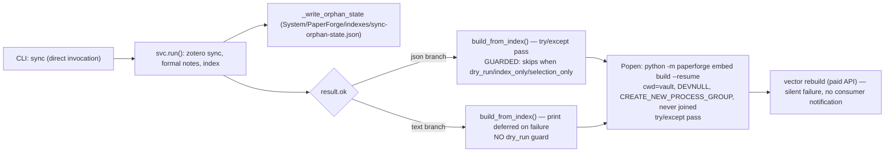
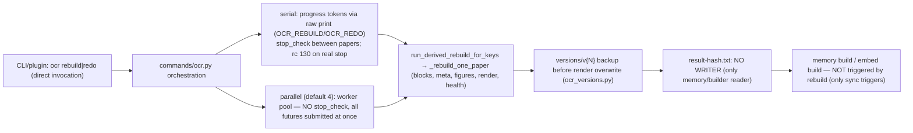
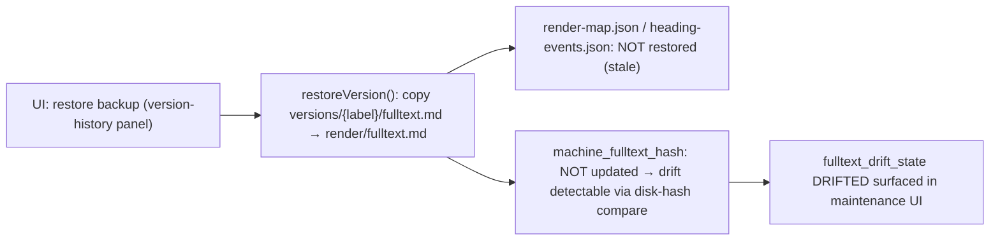

# Product-Lane Architecture Analysis — #127 / #126 / #129 / #99

- Date: 2026-08-05
- Repo revision: `master` (post-triage, HEAD `f7c6fe70`)
- Scope: the enforced product lane after the #130 triage checkpoint; pre-implementation input for #127 (active) and scope refresh for #126/#129/#99.
- Method: code-verified input/output traces (architecture-review `trace` semantics: input → output → transport → side effects → publication → invalidation → failure → final consumer), cross-checked against issue text. Every claim carries a file:line anchor.

---

## 1. Trace A — `paperforge sync` → memory build → embed build (issue #127)

### Verified facts

| Point | Evidence |
|---|---|
| Two fire-and-forget spawn sites (json + text branches) | `paperforge/commands/sync.py:92-97` (json), `:116-121` (text) |
| Both DEVNULL + detached + never joined + `except Exception: pass` | same lines |
| json branch guards follow-up with `not dry_run and not index_only and not selection_only` | `sync.py:100-101` |
| **text branch has NO dry_run guard** — `sync --dry-run` (non-json) still runs `build_from_index` and spawns `embed build --resume` | `sync.py:126-133` |
| `PFResult.next_actions` field exists and round-trips | `paperforge/core/result.py:26, 53-54, 77-78` |
| `next_actions` has **zero producers and zero consumers** in the entire repo | grep survey (2026-08-05) |

### Contract gaps vs issue #127

- **G1 (CORRECTED 2026-08-05 — not a live P0):** `sync --dry-run` **already returns before `svc.run()`** (`commands/sync.py:39-52`, both json and text branches), so it never reaches `build_from_index` or the embed spawn. Downgraded to a **regression-test requirement**: the dry-run early-return must be covered so a future refactor cannot silently re-enable follow-ups. (Initial analysis read only the `run()` tail and missed the early return — external review caught it.)
- **G2 (missing):** the follow-up logic is duplicated across both branches; the #127 `next_actions` cutover must replace both sites in one pass (single producer seam) or the text branch will drift.
- **G3 (unresolved by issue):** `build_from_index` is synchronous local work (no API cost) but O(n) and unconditional on the text branch. #127 must decide its `next_actions` entry: `{action: memory_build, automatic: true, cost: local}` vs keeping it inline. Issue text only discusses the embed follow-up.
- **G4 (missing):** `OCR_RUN` is declared in the plugin progress parser (`paperforge/plugin/src/services/progress-parser.ts:32` KNOWN_PREFIXES) but no backend emitter exists — dead contract; cleanup candidate for #126/#101.
- **G12 (external review, adopted):** #127 contract hardened — `cost`/`impact`/`confirmation` split axes (remote_possible or destructive ⇒ never automatic, ⇒ confirmation required); execution ownership (command core produces only, CLI runner executes automatic-local inline, `--json` prints once with no follow-up, plugin is the only executor); typed `action_id` allowlist (never free-form command strings); scope/dedupe/loop-guard/partial-outcome invariants. See #127 body "Contract hardening".

## 2. Trace B — OCR rebuild/redo → derived publication → downstream (issue #126)

### Verified facts

| Point | Evidence |
|---|---|
| **P0 double-prefix root cause:** `resolveVaultPaths().systemDir` already includes `PaperForge` (`path.join(vaultPath, cfg.system_dir, "PaperForge")`) | `paperforge/plugin/src/services/memory-state.ts:119` |
| Frontend `_openFulltext` joins `systemDir` + `"PaperForge"` again → `System/PaperForge/PaperForge/ocr/…` | `paperforge/plugin/src/views/ocr-workspace.ts:658-663`, `dashboard.ts:1827` (and bundled `main.js:9021`) |
| Correct reference: `version-history.ts ocrRoot()` uses `paths.ocrDir` (= `systemDir/ocr`, no second prefix) — restore works while fulltext open fails | `version-history.ts:34-37` |
| Progress tokens are raw `print(f"…_PROGRESS:…")`, no shared emitter helper | `paperforge/commands/ocr.py:304,316,324,350,564,569,592` |
| Serial stop: `_is_stopped()` between papers; `return 130 if _real_stop else 0` | `commands/ocr.py:596-597` |
| **Parallel rebuild ignores stop:** "Parallel path: does not support stop_check — all futures submitted at once" | `paperforge/worker/ocr_rebuild.py:616-620` (`_run_parallel_rebuild`) |
| `index/result-hash.txt` readers exist (3-level fallback), no writer anywhere | `paperforge/memory/builder.py:578-589` |
| Derived rebuild backs up `render/` → `versions/v{N}/` before overwrite | `paperforge/worker/ocr_versions.py:151-217` |
| Rebuild does not chain to memory/embed; only sync triggers them | survey |

### Contract gaps vs issue #126

- **G5 (missing):** the Stop contract must cover the parallel path (default 4 workers). Options: batch-chunked submission with stop between chunks, or futures cancellation on stop. Issue B/C PRs only describe the controller side.
- **G6 (issue covers writer side only):** the pending-marker publication contract replaces the unwritten `result-hash.txt` — but the READER (`memory/builder.py:578-589` fallback ladder) must be updated in the same PR, or stale hashes propagate.
- **G7 (addendum to P0):** fix sites = `ocr-workspace.ts`, `dashboard.ts`, and the bundle `main.js`; root cause is `systemDir` semantics (already containing `PaperForge`). Prefer single path helper (`ocrDir`) over string concatenation.
- G4 (see §1): dead `OCR_RUN` prefix.

## 3. Trace C — version restore (issue #129)

### Verified facts

| Point | Evidence |
|---|---|
| Restore copies only `fulltext.md`; returns bool | `paperforge/plugin/src/services/version-history.ts:162-185` |
| `versions/{label}/` stores more than fulltext: fulltext.md + render-map.json + heading-events.json | `paperforge/worker/ocr_versions.py:151-217` (backup_render_before_rebuild) |
| Drift IS detectable after restore (disk hash vs `machine_fulltext_hash`) | `paperforge/worker/ocr_fulltext_state.py:20-27` (`get_fulltext_drift_state`); consumed at `ocr-maintenance-ui.ts:107-110` |
| No restore provenance is persisted (no record of which label/version was restored, when) | survey |

### Contract gaps vs issue #129

- **G8 (missing):** a display restore that copies only `fulltext.md` leaves `render-map.json`/`heading-events.json` pointing at the current version — the "display" itself becomes inconsistent. Either restore the full render snapshot (fulltext + render-map + heading-events) or explicitly scope the action to fulltext-only and surface the limitation in the confirmation dialog.
- **G9 (missing):** persist restore provenance (label, timestamp, `ocr_result_hash` at restore time) so `fulltext_drift_state` can distinguish "user restored display version" from "output diverged". Issue mentions marking drift when restored version predates `ocr_result_hash`; the provenance record is the mechanism.

## 4. Trace D — redo safety (issue #99, owner decision)

### Verified facts

| Point | Evidence |
|---|---|
| **#99 premise is outdated:** redo is already transactional (`_redo_one_paper_transaction`: snapshot → mutate → validate → commit/rollback) | `paperforge/worker/ocr.py:2158-2270` |
| Snapshot = tempdir copy of `ocr/<key>` + workspace fulltexts + note text | `worker/ocr.py:2197-2200, 2208-2232` |
| Rollback restores ocr dir, workspace fulltexts, note, and refreshes index | `worker/ocr.py:2204-2218` |
| Crash between mutate and commit leaves an orphaned tempdir (no auto-recovery) | design review |
| Issue body cites `ocr.py:2230 shutil.rmtree before processing` — that behavior no longer exists in that form | issue text vs code |

### Contract gaps vs issue #99

- **G10 (scope refresh required):** remaining work = (a) pipeline unification (redo = PaddleOCR API source vs rebuild = local blocks — still two paths), (b) crash-orphan snapshot recovery policy (scan `paperforge-redo-*` tempdirs on startup), (c) explicit backup strategy (hard-link vs tempdir) aligned with the #126 publication contract. The "redo deletes without backup" premise is fixed; the issue must be rewritten before implementation.
- **G11 (context for #102, deferred):** `embed build --force` pre-rebuild backup exists only on the in-place fallback path (`commands/embed.py:562-577`); the shadow path (default for force/model-change) needs no pre-rebuild backup because the shadow DB + commit-point `os.replace` publish is itself the safety net. #102 should scope the backup to the in-place path only.

## 5. Consolidated issue-change list

| Issue | Change |
|---|---|
| #127 | Add G1 regression test (dry-run early-return exists), G2 (single next_actions producer seam replacing both spawn sites), G3 (memory build `next_actions` entry decision), G12 (contract hardening: cost/impact/confirmation split, execution ownership, typed action_id allowlist, safety invariants, PR A–D split) |
| #126 | Add G5 (parallel-path Stop), G6 (result-hash reader update in same PR as writer), G7 (P0 fix sites + root cause; use `ocrDir` helper); **LOCKED**: colon wire format (no `|`), wire tokens carry key only (titles from paper map), OCR START/DONE for single and batch |
| #129 | Add G8 (restore fulltext-only, locked), G9 (restore provenance persistence) |
| #99 | Add scope-refresh note: transactional redo exists (#123); rewrite remaining scope (unification, crash-orphan recovery, backup strategy); **split into #99-A/B/C implementation units** |
| #102 | Add G11 note: pre-rebuild backup applies to in-place path only (closed SUPERSEDED → absorbed into #99) |
| #82 | HARD GATE banner (N+1 published + clean-venv verified + migration window + owner activation); label `ready-for-human` → `blocked` |
| #94 | Live current-state table at top of the map body |
| #63 | Frozen parent-contract banner (canonical implementations #127/#126/#120) |
| #95/#97/#103 | Deferred with code-check notes at #126 acceptance (redo premise fixed; pipeline version/probe likely implemented) |
| #105 | Deferred; split A–D before any activation |
| #134 | CI rule allowlist decision noted (post-RC) |

## 6. Verified source inventory (appendices)

- `paperforge/commands/sync.py:59-143` — run() follow-up block
- `paperforge/core/result.py` — PFResult/next_actions
- `paperforge/commands/ocr.py:277-597` — redo/rebuild orchestration, tokens, rc 130
- `paperforge/worker/ocr.py:2158-2270` — redo transaction
- `paperforge/worker/ocr_rebuild.py:593-690` — parallel/serial rebuild entry
- `paperforge/worker/ocr_versions.py:151-217` — versions writer
- `paperforge/worker/ocr_fulltext_state.py` — drift/hash helpers
- `paperforge/memory/builder.py:578-589` — result-hash reader
- `paperforge/commands/embed.py:429-483, 562-577` — shadow routing, in-place backup
- `paperforge/plugin/src/services/memory-state.ts:117-140` — path resolution (P0 root cause)
- `paperforge/plugin/src/views/ocr-workspace.ts:640-680` — _openFulltext (P0)
- `paperforge/plugin/src/services/version-history.ts:149-240` — restore/compare
- `paperforge/plugin/src/services/progress-parser.ts:32,63-71,119-127` — token parser
