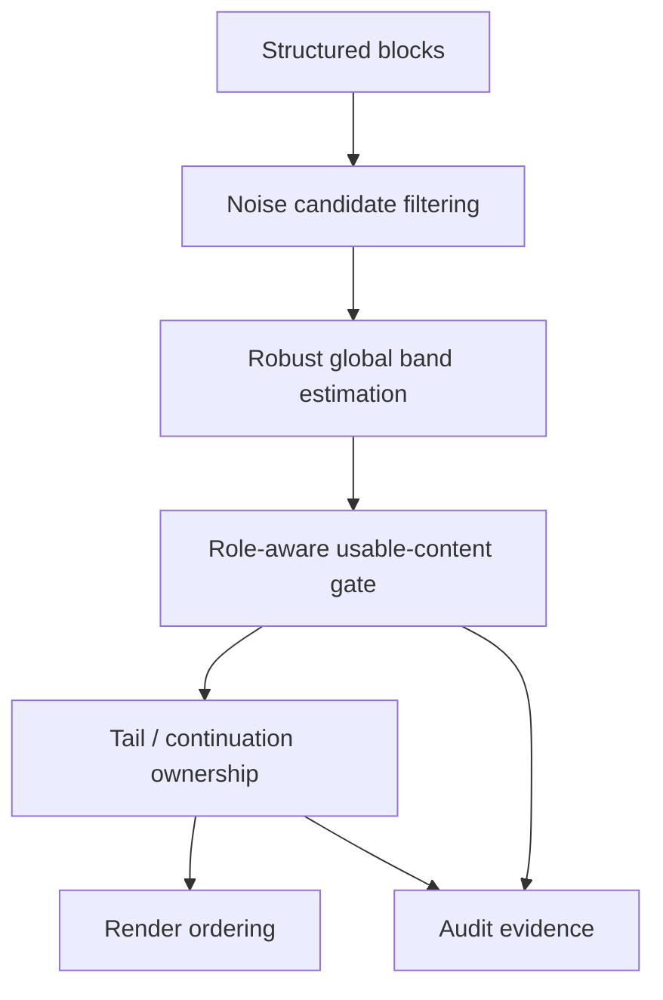

# Layout Robustness Layer — Design Specification

> **Status:** Design drafted from code-path study + corpus scan + representative case studies  
> **Scope:** PaperForge OCR layout robustness for header/footer banding, tail spread routing, and two-column continuation behavior  
> **Recommendation:** Build a robust global noise-band layer first; keep continuation / ownership as separate upper-layer layout problems

---

## 0. Executive Summary

PaperForge currently uses a **global header/footer usable-content band** derived from blocks labeled as noise/header/footer/number. The estimator itself is simple:

- `header_band = max(y2 of top-15%-page noise candidates)`
- `footer_band = min(y1 of bottom-15%-page noise candidates)`

This works on ordinary journal layouts, but fails badly when a paper contains **abnormal margin-band / watermark / downloaded-from publisher strips** or other tall noise blocks. In those cases the global `header_band` can inflate from a normal ~84–110 px to ~984–1575 px, which causes real content to be treated as out-of-band.

The failure is not limited to one rendering site. The current band affects:

1. `body_paragraph` promotion in `ocr_document.py`
2. `body_paragraph` routing in `_reorder_tail_run()`
3. `backmatter_body` routing in `_reorder_tail_run()`
4. historically, `reference_item` routing in `_reorder_tail_run()` before the local safety patch that bypassed band gating for references

This design proposes a **layout robustness layer** with three principles:

1. **Robust global estimation** — the band remains global, but outlier noise blocks do not get to define it
2. **Role-aware gating** — a semantic role already established upstream must not be casually overturned by geometric header/footer heuristics
3. **Layer separation** — global header/footer banding, tail ownership, and two-column continuation references are related but distinct problems and must not be conflated into a single heuristic

This spec deliberately does **not** attempt a one-shot rewrite of all tail logic. The design instead separates the system into a stable lower layer (robust global band estimation) and upper layers (continuation refs, tail ownership, backmatter attachment).

---

## 1. Evidence Base

### 1.1 Static code-path study

`_estimate_noise_bands()` is defined in:

- `paperforge/worker/ocr_document.py:3489-3515`

`_is_in_usable_content()` is defined in:

- `paperforge/worker/ocr_document.py:3475-3486`

Current logic:

```python
bbox = block.get("bbox") or block.get("block_bbox")
if not bbox or len(bbox) < 4:
    return True

y1, y2 = bbox[1], bbox[3]
if header_band is not None and y2 < header_band:
    return False
return not (footer_band is not None and y1 > footer_band)
```

Current estimator:

```python
if role in {"noise", "header", "footer", "number"} or raw_label in (...):
    if y2 < page_height * 0.15:
        header_candidates.append(y2)
    if y1 > page_height * 0.85:
        footer_candidates.append(y1)

header_band = max(header_candidates) if header_candidates else None
footer_band = min(footer_candidates) if footer_candidates else None
```

### 1.2 Corpus scan

Sampled corpus slice:

- **73 papers** (~10% of corpus)
- **1019 pages**
- **18363 blocks**

Observed `header_band` distribution:

- median: **87 px**
- mean: **94 px**
- P25 / P75: **84 / 110 px**
- normal range (observed): **46–284 px**
- normal papers: **84.9%**
- catastrophic outliers: **8.2%**
- no-header papers: **5.5%**

Observed catastrophic outlier pattern:

- `BKKR4KIV`, `ES23M9IS`, `CYJLYG56`, `97M7HFCD`, `65L73ZEZ`, `Y4FGBUSM`
- major outlier: `KH3GMDCH`

Common catastrophic signature:

- very tall, narrow margin-band noise blocks
- publisher “Downloaded from …”, “Accepted Manuscript”, or margin watermark text
- top edge falls within the top 15% of the page
- bottom edge extends through most of the page
- global `header_band` is pulled near page bottom

Observed gated real-content roles in catastrophic papers:

- `reference_item` (314 in sample)
- `body_paragraph` (264)
- `figure_asset` (155)

### 1.3 Representative cases

#### 95FDVE4W

- Two-column tail spread
- Left column bottom contains `References` heading and ref 1
- Right column contains refs 2–19 from near top of page to bottom
- A page-3 empty noise block inflates global `header_band` to **213 px**
- Historical symptom: ref 2 rendered before `## References`

This page reveals **two distinct problems**:

1. band-gating can misclassify high-on-page references or body blocks
2. two-column continuation references violate the simple geometric rule `bbox[1] >= ref_bottom`

#### 3CEUN7T3

- Single-column stable layout
- `header_band=109`
- running header is consistent
- first real body content begins below the band on all pages
- no incorrect gating

This is the good-case target behavior.

#### Margin-band watermark papers

Examples from corpus scan show `header_band` at **1326–1575 px**, effectively classifying most of the page as “header zone.” This is a pure estimator failure, not a subtle downstream rendering issue.

---

## 2. Problem Statement

The current design has three coupled weaknesses.

### 2.1 Naive global aggregation

The estimator is global, but not robust. A single abnormal noise block with a large bottom `y2` can dominate the entire paper’s header band.

### 2.2 Semantic role override by geometry

Once a block has a strong semantic role (for example `reference_item`), header/footer heuristics should not casually demote it into ordinary flow. Doing so turns a layout-estimation error into a semantic-routing error.

### 2.3 Banding and continuation logic are conflated

Banding answers one question:

> Is this block likely inside a true header/footer noise region?

Continuation logic answers a different question:

> Given a two-column tail page or a cross-page spread, which structural region owns this block?

The current system lets the first question preempt the second too early.

---

## 3. Non-Goals

This spec does **not** attempt to:

1. redesign all OCR role classification
2. replace the full tail spread / reference ownership pipeline in one pass
3. convert the entire system to page-local bands
4. solve figure/table ownership through the band layer
5. use visual ML to infer headers dynamically at render time

Specifically, this design rejects “page-local only” as the primary strategy. The evidence supports a **global but robust** estimator, not a per-page estimator that can jitter with page-local anomalies.

---

## 4. Design Principles

### 4.1 Majority-stable pages define the band

The correct header/footer band is the one consistently supported by the majority of stable pages in the paper, not the maximum excursion of any candidate noise block.

### 4.2 Outlier noise must be filtered before aggregation

Margin-band download strips, accepted-manuscript rails, and publisher watermarks are not header lines. They are outlier noise geometry and must not participate in band definition.

### 4.3 Banding is a lower-layer signal, not a semantic authority

The band layer may veto uncertain body-like blocks, but it must not override already-confirmed semantic roles such as `reference_item`.

### 4.4 Column-aware continuation is a separate layer

Two-column tail spreads require explicit continuation logic. A robust band alone will not solve cases where right-column refs start high on the page while the heading sits at the bottom of the left column.

### 4.5 Every robustness decision must remain auditable

When a noise block is excluded from band estimation, or when a block bypasses band gating due to role, the system must preserve structured evidence for later audit.

---

## 5. Target Architecture

The layout robustness layer is divided into four stacked sublayers.



### 5.1 Layer A — Noise candidate filtering

Input: candidate noise/header/footer/number blocks.

Responsibility:

- reject or downweight outlier geometry before band estimation
- identify margin-band / watermark style artifacts
- preserve why a candidate was excluded or included

Candidate exclusion signals may include:

- block height exceeds a configured fraction of page height
- block width is narrow and height is very tall
- evidence indicates margin-band / watermark / download strip
- text matches known publisher watermark patterns
- empty or near-empty noise blocks with anomalously tall bbox

### 5.2 Layer B — Robust global band estimation

Input: filtered candidate set from Layer A.

Responsibility:

- compute one paper-level `header_band` and one paper-level `footer_band`
- use robust aggregation, not naive `max` / `min`
- expose supporting-page counts and outlier rejections for audit

Accepted design direction:

- global estimator remains paper-level
- aggregation must be based on the dominant candidate cluster or stable majority pages
- papers with no stable majority may degrade gracefully to `None`

Rejected design direction:

- per-page header/footer band as the primary system contract

### 5.3 Layer C — Role-aware usable-content gate

Input: semantic block role + robust band.

Responsibility:

- apply band-based gating only where it is semantically defensible
- preserve strong semantic roles from accidental demotion

Required contract:

- `reference_item` bypasses header/footer gating
- strong explicit reference-zone members bypass generic content-band gating
- body-like roles (`body_paragraph`, `backmatter_body`) may still use gating, but only with the robust band from Layer B
- the gate must explain whether a block was excluded by geometry, role exception, or uncertainty policy

### 5.4 Layer D — Continuation / ownership layer

Input: blocks that survive or bypass Layer C.

Responsibility:

- resolve two-column continuation references
- attach tail bodies / backmatter bodies to correct owners
- handle cross-page carried sections

Critical separation:

- this layer should not be forced to recover from a bad band estimate
- it must not rely solely on `bbox[1] >= ref_bottom` for two-column continuation references

---

## 6. Role Contracts

### 6.1 `reference_item`

Current desired contract:

- semantic classification is stronger than banding
- once classified as `reference_item`, the block belongs to the reference-routing path
- column/top-of-page position must not demote it into ordinary content

### 6.2 `body_paragraph`

Current desired contract:

- may still be gated by robust banding, because body-like content near real headers/footers can indeed be noise
- however, body promotion on tail spreads must not depend on a corrupted global band

### 6.3 `backmatter_body`

Current desired contract:

- may use robust banding, but if excluded the false-path consequence is serious: heading/body detachment
- therefore the gate should be conservative and auditable

### 6.4 `figure_asset`, `table_caption`, related media roles

This spec does not change their routing directly, but the corpus scan shows they can become collateral damage when a catastrophic header band marks most of the page unusable. The robust estimator should therefore reduce incidental media misgating even before any media-specific redesign.

---

## 7. Failure Families and Required Handling

### F1 — Margin-band watermark hijacks global band

Examples: Wiley download strips, accepted-manuscript vertical rails, publisher watermarks.

Required handling:

- identify as outlier noise geometry
- exclude from band estimation
- keep evidence in audit output

### F2 — Empty or malformed noise block inflates global band

Example: page 3 empty noise block in `95FDVE4W` with `y2=213`.

Required handling:

- empty/tall anomalies must not define the global band
- exclusion must be explainable

### F3 — Strong semantic block demoted by band gate

Historical example: `reference_item` in high-right-column position.

Required handling:

- role-aware bypass for strong semantic roles

### F4 — Two-column continuation refs fail single-y geometry test

Example: refs in right column begin above left-column heading bottom.

Required handling:

- move ownership logic to a column-aware continuation rule
- do not require `bbox[1] >= ref_bottom` as a necessary condition for all references

### F5 — Tail body promotion suppressed by corrupted band

Affected site: `_promote_tail_body_candidates()` in `ocr_document.py`.

Required handling:

- ensure robust band quality before promotion depends on it
- consider exposing diagnostics when many candidate tail bodies are skipped only by band gate

---

## 8. Rollout Strategy

### Phase 0 — Preserve safe local patches

Keep already-validated narrow fixes that are semantically correct:

- `reference_item` bypasses `_is_in_usable_content()` during tail render routing

### Phase 1 — Robust global band estimator

Implement the new band estimator and candidate filtering layer.

Deliverables:

- candidate filtering policy
- robust aggregation policy
- traceable evidence output
- regression fixtures from catastrophic sample papers

### Phase 2 — Role-aware gate normalization

Revisit every `_is_in_usable_content()` call site and define explicit role contracts:

- strong roles bypass
- uncertain roles gated
- false-path consequences documented

### Phase 3 — Two-column continuation and tail ownership

Redesign reference continuation and tail ownership logic with explicit column reasoning.

Deliverables:

- replacement for naive `bbox[1] >= ref_bottom` dependency
- tail spread continuation tests
- carried_ref / carried_backmatter interactions documented

### Phase 4 — Audit and regression hardening

Add corpus-level checks for:

- suspiciously high header bands
- large gated real-content counts
- excluded candidate diagnostics
- per-paper robustness summaries

---

## 9. Validation Strategy

### 9.1 Unit-level validation

Need targeted tests for:

1. margin-band noise exclusion from global band estimation
2. empty tall noise block exclusion
3. `reference_item` bypass behavior
4. `body_paragraph` / `backmatter_body` still gated under real header/footer cases
5. two-column continuation refs surviving reference routing

### 9.2 Corpus-level validation

Track on representative sample:

- distribution of `header_band`
- count of gated real-content blocks by role
- catastrophic-paper false-positive reductions
- no regressions on stable ordinary single-column papers

### 9.3 Paper-level regression set

Must include at minimum:

- `95FDVE4W` — two-column tail references
- `WV2FF4NV`
- `58UFL9UN`
- several catastrophic watermark-margin papers from corpus scan (`BKKR4KIV`, `ES23M9IS`, `97M7HFCD`, `KH3GMDCH`)
- one stable baseline paper such as `3CEUN7T3`

---

## 10. Open Questions

1. Should robust global aggregation use clustering, trimmed maxima, or a dominant-page-support threshold?
2. Should margin-band exclusion rely purely on geometry, purely on evidence/text, or both?
3. Should `backmatter_body` remain gated by the band, or move to a softer rule when tail spread anchors are present?
4. Should `figure_asset` / `table_caption` receive any role-aware bypass, or should band cleanup alone solve most of their false gating?
5. How much of two-column continuation should be solved in `ocr_document.py` versus `ocr_render.py`?

This spec intentionally leaves those as implementation-design choices while fixing the architectural direction.

---

## 11. Recommended Direction

Adopt **robust global estimation** as the canonical strategy.

Specifically:

1. **Do not** switch to page-local bands as the primary model
2. **Do** filter out anomaly noise candidates before aggregation
3. **Do** make the global estimator majority-stable-page driven
4. **Do** preserve strong semantic roles from band demotion
5. **Do** treat two-column continuation refs as a distinct upper-layer ownership problem

This is the smallest architecture that addresses the evidence without overcommitting to a full OCR pipeline rewrite.
