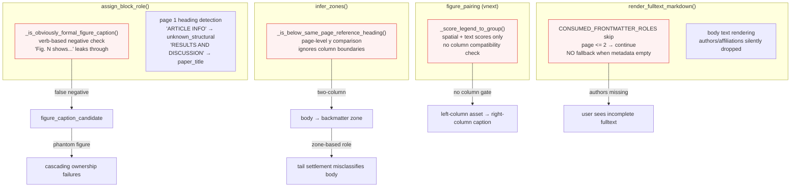

# Four-PR Architecture Hardening Design

> **Date:** 2026-07-05
> **Status:** Draft — ready for implementation
> **Audit Source:** `docs/superpowers/analysis/2026-07-05-layout-truth-audit-findings.md`
> **Design review:** GPT-analyzed, 6 bug patterns, 4 PR execution plan

---

## Design Principle

Do not layer new heuristics on top of old ones. Each bug pattern signals a **missing signal** that already exists elsewhere in the pipeline but is not connected to the decision point. The fix is to complete the signal path, not to add another gate.

```
Role layer: seed role misclassifications only — Fig. N shows ≠ formal caption
Document layer: zone boundary must be column-aware, not page-level
Pairing layer: caption-asset matching must check column compatibility
Render layer: metadata consumption must have fallback when metadata is empty
```

---

## Architecture Diagram (Before)



---

## Architecture Diagram (After)

```mermaid
flowchart TB
    subgraph assign_block_role["assign_block_role()"]
        new_heuristic["_is_obviously_formal_figure_caption()<br/>positive evidence + inline mention reject<br/>'Fig. N shows...' → body_paragraph"]
        fh["_is_short_structural_heading()<br/>'ARTICLE INFO' → frontmatter_heading"]
    end

    subgraph infer_zones["infer_zones()"]
        col_aware["_is_below_same_page_reference_heading()<br/>+ column band check<br/>left-column body NOT pulled"]
    end

    subgraph pairing["figure_pairing (vnext)"]
        col_scoring["_score_legend_to_group()<br/>+ _column_compatible_for_caption_asset()<br/>cross-column → score=0, rejected"]
    end

    subgraph render["render_fulltext_markdown()"]
        fallback["_collect_frontmatter_fallback_lines()<br/>runs before body loop<br/>metadata empty → block fallback"]
        safe_skip["CONSUMED_FRONTMATTER_ROLES skip<br/>page <= 2 → continue<br/>SAFE: already consumed"]
    end

    new_heuristic -->|correct| body_role["body_paragraph"]
    new_heuristic -->|formal caption preserved| formal["figure_caption"]
    col_aware -->|left column| body_zone["body_zone ✓"]
    col_aware -->|right column| ref_zone["reference_zone ✓"]
    col_scoring -->|rejected| no_match["no cross-column match"]
    col_scoring -->|compatible| normal_match["normal match"]
    fallback -->|metadata present| skip_block["skip block (existing contract)"]
    fallback -->|metadata empty| render_content["render block content"]

    style new_heuristic fill:#eef2ff,stroke:#6366f1
    style col_aware fill:#eef2ff,stroke:#6366f1
    style col_scoring fill:#eef2ff,stroke:#6366f1
    style fallback fill:#eef2ff,stroke:#6366f1
```



---

## PR 1: Frontmatter Render Fallback

**Risk:** Low. **User impact:** High (authors/affiliations missing from output).

### Problem

`render_fulltext_markdown()` at `ocr_render.py:1160–1866` defines:

```python
CONSUMED_FRONTMATTER_ROLES = frozenset({
    "paper_title", "authors", "doi", "affiliation", "email", "correspondence",
})
```

Then in the body loop:

```python
if role in CONSUMED_FRONTMATTER_ROLES and int(block.get("page", 0) or 0) <= 2:
    continue
```

And the metadata section only renders:

```python
authors_display = resolved_metadata.get("authors_display", "")
if not authors_display:
    authors = resolved_metadata.get("authors", {}).get("value", [])
    if authors:
        authors_display = ", ".join(authors)
if authors_display or journal or year or doi:
    lines.append("> [!info]- Paper Metadata")
```

**Result:** When `resolved_metadata["authors"]` is empty, the skip contract is violated — blocks are skipped but nothing replaces them. The title is always rendered via `resolved_metadata["title"]`, but authors/affiliations have no fallback.

### Solution

#### New function: `_collect_frontmatter_fallback_lines()`

```python
def _collect_frontmatter_fallback_lines(
    structured_blocks: list[dict],
    resolved_metadata: dict,
) -> list[str]:
```

**Contract:**
- `paper_title`: only when `resolved_metadata["title"]["value"]` is empty
- `authors`: only when both `authors_display` and `resolved_metadata["authors"]["value"]` are empty
- `affiliation` / `email` / `correspondence`: when metadata has no equivalent field
- `doi`: never — metadata has DOI, avoid duplicate

**Implementation:**
1. Scan `structured_blocks` for blocks with role in `CONSUMED_FRONTMATTER_ROLES` on pages 1–2
2. Group by role
3. Only collect blocks for which metadata is missing
4. Return formatted lines (under an existing metadata callout if present, or create one)

**Insertion point:** After existing metadata section, before body loop. Keep the `continue` skip unchanged — this makes the skip safe rather than removing it.

**Do NOT:**
- Remove the `continue` skip — that would render frontmatter blocks as body text
- Add role exceptions inside the body loop
- Change `render_default` on any block

#### Tests

```python
def test_render_frontmatter_authors_fallback_when_metadata_empty():
    """Page 1 authors block appears in metadata callout when resolved_metadata has no authors."""
def test_render_frontmatter_affiliations_fallback_when_metadata_empty():
    """Page 1-2 affiliation blocks appear in metadata callout when none in metadata."""
def test_render_frontmatter_does_not_duplicate_when_metadata_present():
    """Metadata callout has authors from resolved_metadata; frontmatter blocks still skipped."""
def test_render_frontmatter_title_fallback_when_title_metadata_empty():
    """Paper_title block rendered when resolved_metadata title missing."""
def test_render_frontmatter_doi_not_fallback():
    """DOI block never rendered as fallback — metadata DOI is authoritative."""
```

**Files touched:** `paperforge/worker/ocr_render.py`, `tests/test_ocr_render.py`

---

## PR 2: Formal Figure Caption Heuristic Tightening

**Risk:** Medium-low. **Key risk:** false positive on real captions (rotated, sidecar, short). Must preserve existing behavior for all 8 gold fixtures.

### Problem

`_is_obviously_formal_figure_caption()` at `ocr_roles.py:193–204`:

```python
verb_patterns = ["shows", "illustrates", "depicts", "demonstrates", "presents", "summarizes"]
has_verb = any(v in text.lower() for v in verb_patterns)
sentence_markers = [" is ", " are ", " was ", " were "]
has_sentence = any(m in text.lower() for m in sentence_markers)
if has_verb and has_sentence:
    return False  # Only rejects when verb AND sentence marker BOTH present
is_short = len(text) <= 80
near_media = _is_near_figure_media(block, page_blocks)
return is_short or near_media
```

**Bug:** Body text "Fig. 9 shows the Mössbauer spectrum..." has `has_verb=True, has_sentence=False` — passes through as formal caption.

### Solution

#### Phase 1: Add `_INLINE_FIGURE_MENTION_PATTERN` negative check

```python
_INLINE_FIGURE_MENTION_PATTERN = re.compile(
    r"^\s*(?:fig(?:ure)?\.?\s+\d+[a-z]?|figs?\.?\s+\d+[a-z]?)\s+"
    r"(?:shows?|illustrates?|depicts?|demonstrates?|presents?|summarizes?|"
    r"reveals?|indicates?|compares?|contains?|provides?|displays?|represents?)\b",
    re.I,
)
```

Insert at top of `_is_obviously_formal_figure_caption()`:

```python
if _looks_like_inline_figure_mention(text, block):
    return False
```

#### Phase 2: Convert heuristic from "negative" to "positive evidence"

```python
def _is_obviously_formal_figure_caption(text, block, page_blocks):
    if not _has_figure_prefix(text):
        return False
    if _looks_like_inline_figure_mention(text, block):
        return False
    near_media = _is_near_figure_media(block, page_blocks)
    raw_label = str(block.get("raw_label") or block.get("block_label") or "")
    if raw_label == "figure_title":
        return True
    if near_media and _looks_like_caption_syntax(text):
        return True
    if len(text) <= 80 and _looks_like_caption_syntax(text):
        return True
    return False
```

#### New helper: `_looks_like_caption_syntax()`

Narrow: requires `Figure N` + delimiter (`.`, `:`, `|`, `—`) or caption-like short title.

```python
_CAPTION_SYNTAX_PATTERN = re.compile(
    r"(?:figure|fig\.?)\s+\d+[a-z]?\s*[.:|—–]",
    re.I,
)

def _looks_like_caption_syntax(text: str) -> bool:
    """Formal caption requires numbered prefix with delimiter."""
    return bool(_CAPTION_SYNTAX_PATTERN.search(text))
```

#### Architecture note: shared pattern source

`ocr_figures.py` has `_looks_like_figure_narrative_prose()`. Late resolution has `_looks_like_late_figure_narrative_prose()`. The new `_looks_like_inline_figure_mention()` should be defined in `ocr_roles.py` and used by both early and late resolution.

#### Tests

```python
def test_fig_shows_body_mention_not_formal_caption():
    """"Fig. 9 shows results" → body_paragraph, not figure_caption."""
def test_fig_period_caption_remains_caption():
    """"Figure 1. Histological analysis" → figure_caption."""
def test_near_media_does_not_rescue_inline_body_mention():
    """Block near figure_asset but text is "Fig. 2 shows..." → NOT caption."""
def test_figure_title_raw_label_still_caption():
    """raw_label=figure_title always → figure_caption, regardless of text."""
def test_short_near_media_formal_caption_preserved():
    """"Fig. 3. Results" near media → figure_caption."""
def test_all_gold_fixtures_preserved():
    """Run 8 fixture-based regression tests — no change in matched figure count."""
```

**Files touched:** `paperforge/worker/ocr_roles.py`, `tests/test_ocr_roles.py`, `tests/test_ocr_figures.py` (one regression gate)

---

## PR 3: Same-Page Reference Boundary — Column-Aware Zone Inference

**Risk:** Medium. **Key constraint:** Must preserve single-column same-page boundary behavior (verified as correct in 28JLIHLS audit).

### Problem

`infer_zones()` → `_is_below_same_page_reference_heading()` at `ocr_document.py`:

```python
def _is_below_same_page_reference_heading(block, page_blocks):
    """Check if block is below a reference heading on the same page."""
    block_y = _block_y_top(block)
    for other in page_blocks:
        if other is block:
            continue
        if _is_reference_heading_candidate(other):
            other_y = _block_y_top(other)
            if other_y and block_y and block_y > other_y:
                return True
    return False
```

Only checks y-position. On two-column pages where right column has References heading, left-column body below that y is pulled into `same_page_tail_blocks` → `tail_nonref_hold_zone`.

### Solution

#### New helper: `_is_in_same_reference_column()`

```python
def _is_in_same_reference_column(
    block: dict,
    ref_heading_block: dict | None,
    page_width: float,
) -> bool:
```

**Logic:**
1. If `ref_heading_block is None`: return False (no reference heading to compare to)
2. If block bbox or ref heading bbox is missing: return True (conservative — don't change existing behavior for missing data)
3. If ref heading is full-width (covers >70% of page width): return True (page-level boundary, same as current behavior)
4. Otherwise: check column compatibility:
   - Calculate column band for each (left=0, right=1, center=ambiguous)
   - Same band → True
   - Different bands → False
   - Either ambiguous → True (conservative)
   - Block is full-width → True

#### Column helper placement

Add to `ocr_document.py` as private function. Do NOT import `_column_band_id` from `ocr_figures.py` (avoids cross-module dependency from document layer to figure layer). The column logic is simple enough to duplicate:

```python
def _block_column_band(bbox, page_width):
    """0=left, 1=right, None=center/ambiguous."""
    if not bbox or len(bbox) < 4 or not page_width:
        return None
    cx = (bbox[0] + bbox[2]) / 2.0
    if cx < page_width * 0.45:
        return 0
    if cx > page_width * 0.55:
        return 1
    return None
```

#### Modification point

The `same_page_tail_blocks` list comprehension in `infer_zones()`:

```diff
 same_page_tail_blocks = [
     block
     for block in blocks
-    if _is_below_same_page_reference_heading(block, page_blocks)
+    if _is_below_same_page_reference_heading(block, page_blocks)
+    and _is_in_same_reference_column(
+        block,
+        _find_same_page_reference_heading(block, page_blocks),
+        page_width,
+    )
     ...
 ]
```

Need to also add `_find_same_page_reference_heading()` — returns the specific ref heading block that `_is_below_same_page_reference_heading` detected, for column comparison.

#### Tests

```python
def test_same_page_reference_heading_does_not_pull_left_column_conclusion():
    """Two-column: left column Conclusions NOT pulled into tail zone when ref heading is in right column."""
def test_same_page_reference_heading_pulls_same_column_tail_note():
    """Two-column: right-column note below ref heading IS pulled into tail zone."""
def test_single_column_same_page_reference_boundary_still_works():
    """Single-column same-page reference boundary still correctly detected."""
def test_same_page_reference_heading_full_width_ref_still_page_level():
    """Full-width reference heading still pulls page-level body below it."""
def test_same_page_reference_heading_no_ref_on_page_no_change():
    """Page without reference heading — no behavior change."""
def test_28jlihls_single_column_clear_separation_preserved():
    """Fixture: single-column same-page boundary remains FALSE POSITIVE (no false alarm)."""
```

**Files touched:** `paperforge/worker/ocr_document.py`, `tests/test_ocr_document.py`

---

## PR 4: VNext Figure Pairing — Column Compatibility in Candidate Scoring

**Risk:** Medium. **Key constraint:** Sidecar captions (same-row adjacent column) must still match.

### Problem

`PrimarySamePagePass` at `ocr_figure_vnext_passes.py` calls `_score_legend_to_group()` in `ocr_figures.py`. The scoring function considers spatial distance, text overlap, and orientation, but does NOT check column compatibility. A left-column figure asset can be matched to a right-column figure caption if they are vertically close.

`_is_safe_page_assets_group()` (`ocr_figures.py:283`) does have a column band gate that rejects cross-column groups, but this gate only applies to the `page_assets` grouping step, not to the caption-to-group scoring step. Column information is computed during grouping but never passed to scoring.

### Solution

#### 1. New helper: `_column_compatible_for_caption_asset()`

In `ocr_figures.py`:

```python
def _column_compatible_for_caption_asset(
    caption_bbox: list[float],
    asset_bbox: list[float],
    page_width: float,
    *,
    allow_full_width: bool = True,
) -> tuple[bool, str]:
    """Check if caption and asset are in compatible columns for matching.

    Returns (compatible: bool, reason: str).
    Compatible means they CAN be the same figure, not that they MUST be.
    """
    if not caption_bbox or len(caption_bbox) < 4 or not asset_bbox or len(asset_bbox) < 4:
        return True, "no_bbox"

    cap_band = _column_band_id(caption_bbox, page_width)
    asset_band = _column_band_id(asset_bbox, page_width)

    # Either is full-width → always compatible (spans all columns)
    if cap_band is None or asset_band is None:
        return True, "full_width_or_center"

    # Same column → compatible
    if cap_band == asset_band:
        return True, "same_column"

    # Different columns → incompatible
    return False, f"cross_column:caption={cap_band}_asset={asset_band}"
```

#### 2. Group-level check in `_score_legend_to_group()`

At the beginning of `_score_legend_to_group()` in `ocr_figures.py`, before per-asset scoring:

```python
def _score_legend_to_group(legend, group, page_width, ...):
    # Column compatibility check (group-level)
    legend_bbox = legend.get("bbox") or [0, 0, 0, 0]
    if not group.get("column_band"):
        group["column_band"] = _group_column_band(group.get("media_blocks", []), page_width)

    compatible, reason = _column_compatible_for_caption_asset(
        legend_bbox, group.get("cluster_bbox", [0, 0, 0, 0]), page_width,
    )
    if not compatible:
        return {
            "score": 0.0,
            "decision": "rejected",
            "evidence": ["cross_column_caption_asset", reason],
        }
    # ...existing scoring logic...
```

#### 3. Candidate group metadata enrichment

In `_candidate_group_entry()` or equivalent, add:

```python
{
    "column_band": _group_column_band(media_blocks, page_width),
    "column_evidence": "...",
}
```

`_group_column_band()` returns the dominant column band for the group's media blocks, or `None` if the group spans multiple columns (composite figure).

#### 4. Sidecar exception

Sidecar captions (same row, adjacent column) should still match. The column check should allow matching when:
- Caption and asset are in adjacent columns (band 0→1 or 1→0)
- They have y-overlap (same visual row)
- The caption is narrow (sidecar width < 40% of page width)

```python
def _is_sidecar_exception(caption_bbox, asset_bbox, page_width):
    """Sidecar: same row, adjacent column, narrow caption."""
    caption_width = (caption_bbox[2] - caption_bbox[0]) if len(caption_bbox) >= 4 else 0
    if caption_width > 0 and caption_width < page_width * 0.4:
        cap_band = _column_band_id(caption_bbox, page_width)
        asset_band = _column_band_id(asset_bbox, page_width)
        if cap_band is not None and asset_band is not None and cap_band != asset_band:
            y_overlap = caption_bbox[1] < asset_bbox[3] and caption_bbox[3] > asset_bbox[1]
            return y_overlap
    return False
```

#### Tests

```python
def test_primary_same_page_rejects_cross_column_caption_asset():
    """Left-column caption NOT matched to right-column asset group."""
def test_primary_same_page_allows_full_width_caption_to_center_asset():
    """Full-width caption in center band matches center asset group."""
def test_sidecar_same_row_adjacent_column_still_matches():
    """Narrow sidecar caption in left column matches same-row right-column asset (sidecar exception)."""
def test_composite_multi_column_group_allows_caption_match():
    """Group spanning both columns (composite figure) allows caption in either column."""
def test_cross_column_rejection_does_not_affect_same_column_matches():
    """All existing same-column fixtures preserve their match count."""
def test_28jlihls_fig5_assets_not_assigned_to_fig6():
    """Regression: Figure 5 left-column assets not assigned to Figure 6 right-column caption."""
```

**Files touched:** `paperforge/worker/ocr_figures.py`, optionally `paperforge/worker/ocr_figure_vnext_passes.py`, `tests/test_ocr_figures.py`

---

## Deferred (Not in the 4-PR Plan)

### PR 5: Frontmatter Heading Exact Labels

Add `_FRONTMATTER_SECTION_LABELS` to catch "ARTICLE INFO" → `frontmatter_heading` or `section_heading`. Insert early in `assign_block_role()` before the paper_title fallback. Low priority — cosmetic role labels.

### PR 6: Supplementary-Only Document Mode

Design a `document_mode` detection at pipeline entry. Render via simple fallback. Not a bug fix — a new feature. Requires separate design.

---

## Execution Order & Dependencies

```
PR 1 (render frontmatter) ──→ independent, do first
PR 2 (caption heuristic)  ──→ independent, can parallel with PR 1
PR 3 (zone boundary)      ──→ independent of PR 1/2, depends on 28JLIHLS fixture
PR 4 (pairing column)     ──→ independent of PR 1/2/3, depends on 28JLIHLS fixture
```

All 4 PRs are logically independent and can be implemented in parallel. Recommended order:

1. **PR 1** — smallest diff, highest user impact, proves the process
2. **PR 3** — zone boundary affects the most papers (395/734 multi-column)
3. **PR 2** — caption heuristic affects figure/table quality
4. **PR 4** — pairing column fixes residual cross-column mis-assignment

### Verification after all 4 PRs

```bash
# Full test suite
python -m pytest tests/test_ocr_*.py -v --tb=short

# Real-paper regressions (8 gold fixtures)
python -m pytest tests/test_ocr_real_paper_regressions.py -v --tb=short

# Vault corpus diff (555 papers)
python scripts/dev/corpus_v3_diff_full.py
```

### Cross-cutting Architecture Rule

Every change in these 4 PRs must pass the **deletion test**: if you delete the function/module you're adding, does complexity vanish or concentrate? If it concentrates (callers would need to reimplement the logic), the change is earning its keep. If it vanishes (the function is a pass-through), it's shallow.

```
Frontmatter_fallback_lines:       DELETE → complexity vanishes? Yes → good
_is_in_same_reference_column:     DELETE → zone pollution returns → good
_column_compatible_for_caption:   DELETE → cross-column matches return → good
_is_obviously_formal_figure_caption tightening: DELETE → Fig-N-shows returns → good
```
